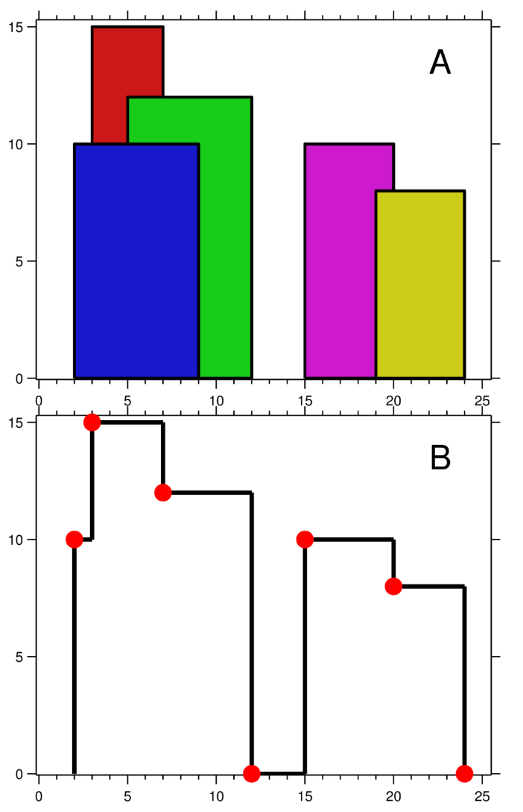
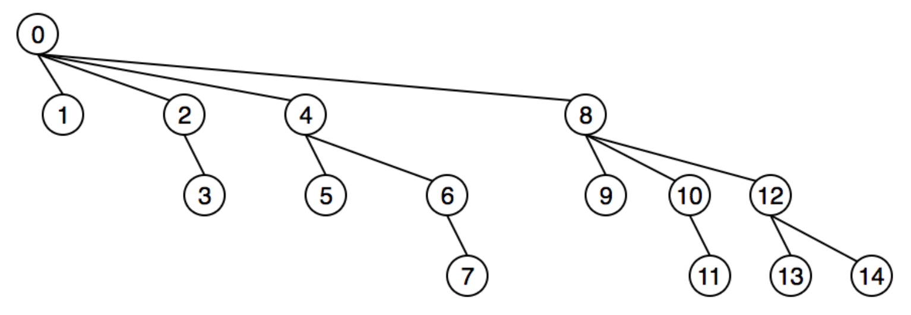

<!-- TOC -->

- [1. 栈和队列](#1-栈和队列)
    - [1.1. 迷宫问题](#11-迷宫问题)
        - [1.1.1. 路径是否存在](#111-路径是否存在)
        - [1.1.2. 最短路径](#112-最短路径)
    - [1.2. 表达式计算](#12-表达式计算)
        - [1.2.1. 中缀转后缀](#121-中缀转后缀)
        - [1.2.2. 后缀表达式计算](#122-后缀表达式计算)
    - [1.3. 最小栈相关题](#13-最小栈相关题)
    - [1.4. 给表达式添加运算符](#14-给表达式添加运算符)
    - [1.5. 目标和](#15-目标和)
    - [1.6. 132问题](#16-132问题)
- [2. 数组](#2-数组)
    - [2.1. 重复元素系列](#21-重复元素系列)
        - [2.1.1. 找所有重复元素（元素只出现一次或两次）（**442，中等**）](#211-找所有重复元素元素只出现一次或两次442中等)
        - [2.1.2. 数组中出现次数超过一半的元素](#212-数组中出现次数超过一半的元素)
        - [2.1.3. 在数组中找到出现次数大于N/k的数](#213-在数组中找到出现次数大于nk的数)
    - [2.2. 逆序对（**剑指offer**）](#22-逆序对剑指offer)
    - [2.3. 划分为k个相等子集](#23-划分为k个相等子集)
    - [2.4. 最长等差序列](#24-最长等差序列)
    - [2.5. 数组的中位数](#25-数组的中位数)
    - [2.6. 原地矩阵旋转](#26-原地矩阵旋转)
- [3. 链表](#3-链表)
    - [3.1. 原地删除列表节点](#31-原地删除列表节点)
    - [3.2. 回文链表](#32-回文链表)
    - [3.3. 链表排序](#33-链表排序)
    - [3.4. 相交链表](#34-相交链表)
- [4. 字符串](#4-字符串)
    - [4.1. KMP](#41-kmp)
    - [4.2. 典型题目](#42-典型题目)
        - [4.2.1. 判断两个字符串是否互为旋转词（**796，简单**）](#421-判断两个字符串是否互为旋转词796简单)
        - [4.2.2. K 距离间隔重排字符串](#422-k-距离间隔重排字符串)
- [5. 二叉树](#5-二叉树)
    - [5.1. 二叉树遍历](#51-二叉树遍历)
        - [5.1.1. 前序](#511-前序)
        - [5.1.2. 中序](#512-中序)
        - [5.1.3. 后序](#513-后序)
        - [5.1.4. 层次](#514-层次)
        - [5.1.5. morris遍历（空间复杂度`O(1)`）](#515-morris遍历空间复杂度o1)
            - [中序](#中序)
    - [5.2. 二叉树序列化和反序列化](#52-二叉树序列化和反序列化)
    - [5.3. 二叉搜索树第k大元素](#53-二叉搜索树第k大元素)
    - [5.4. 判断二叉树是否是完全二叉树](#54-判断二叉树是否是完全二叉树)
    - [5.5. 判断二叉树是否是满二叉树](#55-判断二叉树是否是满二叉树)
    - [5.6. 判断二叉树是不是二叉搜索树](#56-判断二叉树是不是二叉搜索树)
    - [5.7. 二叉树和为某一值的路径](#57-二叉树和为某一值的路径)
    - [5.8. 判断平衡二叉树](#58-判断平衡二叉树)
    - [5.9. 树中两个节点的最临近公共祖先](#59-树中两个节点的最临近公共祖先)
    - [5.10. LeetCode979 在二叉树中分配硬币](#510-leetcode979-在二叉树中分配硬币)
    - [5.11. LeetCode971 翻转二叉树以匹配先序遍历](#511-leetcode971-翻转二叉树以匹配先序遍历)
- [6. 图](#6-图)
    - [6.1. 拓扑排序](#61-拓扑排序)
    - [6.2. Bellman-Ford](#62-bellman-ford)
    - [6.3. Dijkstra](#63-dijkstra)
    - [6.4. Floyd](#64-floyd)
    - [6.5. SPFA](#65-spfa)
    - [6.6. 最小生成树](#66-最小生成树)
        - [6.6.1. Prim](#661-prim)
        - [6.6.2. Kruskal](#662-kruskal)
    - [6.7. TSP问题](#67-tsp问题)
    - [6.8. 一些判断问题](#68-一些判断问题)
        - [6.8.1. 是否有环](#681-是否有环)
        - [6.8.2. 是否为连通图](#682-是否为连通图)
        - [6.8.3. 是否为二分图](#683-是否为二分图)
- [7. BFS/DFS](#7-bfsdfs)
    - [7.1. 岛屿问题](#71-岛屿问题)
- [8. 排序](#8-排序)
    - [8.1. 快排（3分）](#81-快排3分)
    - [8.2. 快排（2分）](#82-快排2分)
    - [8.3. 桶排序](#83-桶排序)
    - [8.4. 归并排序](#84-归并排序)
    - [8.5. 堆排](#85-堆排)
        - [8.5.1. 关于堆的题目：](#851-关于堆的题目)
            - [8.5.1.1. LeetCode218 天际线问题](#8511-leetcode218-天际线问题)
            - [8.5.1.2. LeetCode295 数据流中的中位数](#8512-leetcode295-数据流中的中位数)
    - [8.6. 归并排序](#86-归并排序)
    - [8.7. TimSort](#87-timsort)
        - [8.7.1. 实现步骤：](#871-实现步骤)
    - [8.8. 关于排序的题目](#88-关于排序的题目)
        - [8.8.1. LeetCode315 计算右侧小于当前元素的个数](#881-leetcode315-计算右侧小于当前元素的个数)
        - [8.8.2. LeetCode164 最大间距](#882-leetcode164-最大间距)
        - [8.8.3. LeetCode324 摆动排序](#883-leetcode324-摆动排序)
        - [8.8.4. LeetCode327 区间和的个数](#884-leetcode327-区间和的个数)
- [9. 二分查找](#9-二分查找)
    - [9.1. 数组中的重复元素（**287，中等**）](#91-数组中的重复元素287中等)
    - [9.2. 旋转数组的最小元素（**剑指offer**）](#92-旋转数组的最小元素剑指offer)
    - [9.3. 二分法找元素第一次和最后一次出现位置](#93-二分法找元素第一次和最后一次出现位置)
    - [9.4. LeetCode719 找出第 k 小的距离对](#94-leetcode719-找出第-k-小的距离对)
    - [9.5. 二分法3种模版](#95-二分法3种模版)
- [10. 双指针](#10-双指针)
    - [10.1. 数组中两数和为s的所有组合](#101-数组中两数和为s的所有组合)
    - [10.2. 数组中子数组和为s的所有组合](#102-数组中子数组和为s的所有组合)
- [11. 大数据算法](#11-大数据算法)
    - [11.1. bitmap和布隆过滤器](#111-bitmap和布隆过滤器)
    - [11.2. 数学](#112-数学)
        - [11.2.1. 从1到n元素1出现的次数](#1121-从1到n元素1出现的次数)
- [12. 位运算](#12-位运算)
    - [12.1. 交换两个数（剑指offer）](#121-交换两个数剑指offer)
    - [12.2. 不用加减乘除实现加法（剑指offer）](#122-不用加减乘除实现加法剑指offer)
    - [12.3. 数组中只出现一次的数（两个）](#123-数组中只出现一次的数两个)
    - [12.4. 数组中两个数的最大异或值](#124-数组中两个数的最大异或值)
    - [12.5. LeetCode190 颠倒二进制位](#125-leetcode190-颠倒二进制位)
    - [12.6. LeetCode201 数字范围按位与](#126-leetcode201-数字范围按位与)
- [13. 0-1背包问题](#13-0-1背包问题)
    - [13.1. 分割等和子集](#131-分割等和子集)
    - [13.2. 单词拆分](#132-单词拆分)
    - [13.3. 零钱兑换](#133-零钱兑换)
    - [13.4. 组合总数](#134-组合总数)
    - [13.5. 1和0](#135-1和0)
- [14. 高级数据结构](#14-高级数据结构)
    - [14.1. 并查集（Union-find Sets）](#141-并查集union-find-sets)
        - [14.1.1. 简介](#1411-简介)
        - [14.1.2. 基本操作](#1412-基本操作)
            - [14.1.2.1. `Find`：](#14121-find)
            - [14.1.2.2. `Union`：](#14122-union)
        - [14.1.3. 实现](#1413-实现)
            - [14.1.3.1. 基于链表](#14131-基于链表)
            - [14.1.3.2. 基于数组](#14132-基于数组)
    - [14.2. 线段树（Segment Tree）](#142-线段树segment-tree)
        - [14.2.1. 简介](#1421-简介)
    - [14.3. 红黑树（Red Black Tree）](#143-红黑树red-black-tree)
    - [14.4. 跳跃表（Skipping List）](#144-跳跃表skipping-list)
    - [14.5. 树状数组（Binary Indexed Tree）](#145-树状数组binary-indexed-tree)
        - [14.5.1. 简介](#1451-简介)
        - [14.5.2. 出发点](#1452-出发点)
        - [14.5.3. 操作](#1453-操作)
            - [14.5.3.1. `Update`](#14531-update)
            - [14.5.3.2. `PrefixSum`](#14532-prefixsum)
            - [14.5.3.3. `RangeSum`](#14533-rangesum)
            - [14.5.3.4. 初始化](#14534-初始化)
        - [14.5.4. 实现](#1454-实现)
- [15. 其它](#15-其它)
    - [15.1. LRU缓存机制](#151-lru缓存机制)
    - [15.2. 最大频率栈](#152-最大频率栈)
    - [15.3. 排列组合](#153-排列组合)
    - [15.4. 滚动哈希](#154-滚动哈希)
        - [15.4.1. LeetCode1297 子串的最大出现次数](#1541-leetcode1297-子串的最大出现次数)
        - [15.4.2. LeetCode1044 最长重复子串](#1542-leetcode1044-最长重复子串)
    - [15.5. python拓展](#155-python拓展)
        - [15.5.1. heap（heapq）](#1551-heapheapq)
        - [15.5.2. deque（collections）](#1552-dequecollections)
        - [15.5.3. OrderedDict（collections）](#1553-ordereddictcollections)
        - [15.5.4. bisect](#1554-bisect)
        - [15.5.5. math(floor,ceil)](#1555-mathfloorceil)
        - [15.5.6. ord/chr](#1556-ordchr)

<!-- /TOC -->

# 1. 栈和队列

## 1.1. 迷宫问题

### 1.1.1. 路径是否存在

```
DFS/BFS均可。
找单条路径或者所有路径使用DFS较好。BFS需要额外记录前面走过的位置。
```

### 1.1.2. 最短路径

```
BFS
```

## 1.2. 表达式计算

### 1.2.1. 中缀转后缀

### 1.2.2. 后缀表达式计算

## 1.3. 最小栈相关题
> 见【动态规划】部分**最大矩阵面积**题目

## 1.4. 给表达式添加运算符

> 给定一个仅包含数字 0-9 的字符串和一个目标值，在数字之间添加二元运算符（不是一元）+、- 或 * ，返回所有能够得到目标值的表达式。
```python
class Solution(object):
    def addOperators(self, num, target):
        """
        :type num: str
        :type target: int
        :rtype: List[str]
        """
        def calculate(num, target, expression, prev, ans, results):
            if len(num) == 0 and ans == target:
                results.append(expression)
            else:
                for i in range(1, len(num)+1):
                    if i > 1 and num[0] == '0':
                        continue
                    a = int(num[0:i])
                    if expression == '':
                        calculate(num[i:len(num)], target, num[0:i], a, a, results)
                    else:
                        calculate(num[i:len(num)], target, expression+'+'+num[0:i], a, ans+a, results)
                        calculate(num[i:len(num)], target, expression+'-'+num[0:i], -a, ans-a, results)
                        calculate(num[i:len(num)], target, expression+'*'+num[0:i], a*prev, ans+prev*(a-1), results)
        
        
        results = []
        calculate(num, target, '', 0, 0, results)
        return results
```

## 1.5. 目标和

> 给定一个非负整数数组，a1, a2, ..., an, 和一个目标数，S。现在你有两个符号 + 和 -。对于数组中的任意一个整数，你都可以从 + 或 -中选择一个符号添加在前面。返回可以使最终数组和为目标数 S 的所有添加符号的方法数。

> 思路1:直接dp，dp[(i,j)]代表取前i个数和为j的所有情况数
```python
class Solution:
    def findTargetSumWays(self, nums: List[int], S: int) -> int:
        length, dp = len(nums), {(0,0): 1}
        for i in range(1, length+1):
            for j in range(-sum(nums), sum(nums) + 1):
                dp[(i,j)] = dp.get((i - 1, j - nums[i-1]), 0) + dp.get((i - 1, j + nums[i-1]), 0)             
        return dp.get((length, S), 0)
```

> 思路2:0-1背包。设数组为nums，目标和为target，则取正号的数P的总和为$sum(P)=(sum(nums)+target)/2$，从而问题就转换成在数组里加和为$(sum(nums)+target)/2$集合总数。

## 1.6. 132问题

> **题目**：给定一个整数序列：a1, a2, ..., an，一个132模式的子序列 ai, aj, ak 被定义为：当 i < j < k 时，ai < ak < aj。设计一个算法，当给定有 n 个数字的序列时，验证这个序列中是否含有132模式的子序列。

> **思路**：栈，有点迷（todo）

```python
class Solution:
    def find132pattern(self, nums):
        """
        :type nums: List[int]
        :rtype: bool
        """
        stack = []
        _MIN = float('-inf')
        
        for i in range(len(nums)-1, -1, -1):
            if nums[i] < _MIN:
                return True
            while stack and nums[i] > stack[-1]:
                _MIN = stack.pop()
            stack.append(nums[i])
            #print(stack)
            
        return False
```

# 2. 数组

## 2.1. 重复元素系列

### 2.1.1. 找所有重复元素（元素只出现一次或两次）（**442，中等**）

> **题目**：给定一个整数数组 a，其中**1 ≤ a[i] ≤ n** （n为数组长度）, 其中有些元素出现两次而其他元素出现一次。找到所有出现两次的元素。你可以不用到任何额外空间并在O(n)时间复杂度内解决这个问题吗。

> **思路**：

```python

```

### 2.1.2. 数组中出现次数超过一半的元素
> 使用partition或2.1.3的思路

### 2.1.3. 在数组中找到出现次数大于N/k的数
> 思路：维护一个容量为k的字典，一旦字典满了，则将所有元素减1，为0的元素删掉。最后再对剩下的元素进行正确性判断。

## 2.2. 逆序对（**剑指offer**）

> **题目**：在数组中的两个数字，如果前面一个数字大于后面的数字，则这两个数字组成一个逆序对。输入一个数组,求出这个数组中的逆序对的总数P。

> **思路**：分治法，类似于归并排序。在归并排序的同时计数。

```python
class Solution:
    def __init__(self):
        self.count = 0
    def _InversePairs(self, data):
        # write code here
        
        if len(data) <= 1:
            return data
        
        mid = len(data)//2
        left = self._InversePairs(data[:mid])
        right = self._InversePairs(data[mid:])
        
        sorting = []
        i = 0
        j = 0
        while i < len(left) and j < len(right):
            if left[i] <= right[j]:
                sorting.append(left[i])
                i += 1
                self.count += j
            else:
                sorting.append(right[j])
                j += 1
        while i < len(left):
            sorting.append(left[i])
            self.count += len(right)
            i += 1
        while j < len(right):
            sorting.append(right[j])
            j += 1
        
        return sorting
    
    def InversePairs(self, data):
        self.count = 0
        self._InversePairs(data)
        return self.count % 1000000007
```

## 2.3. 划分为k个相等子集
```python

```

## 2.4. 最长等差序列

> 暴力法
```python
class Solution:
    def longestArithSeqLength(self, A: List[int]) -> int:
        
        self.res = 1
        
        # 递归
        def helper(A,seq):
            if len(A)+len(seq) <= self.res:
                return
            if not A:
                self.res = max(self.res,len(seq))
                return
            if len(seq) >= 2:
                for i in range(len(A)):
                    if A[i]-seq[-1] == seq[-1]-seq[-2]:
                        seq.append(A[i])
                helper([],seq)
            else:
                helper(A[1:],seq+[A[0]])
                helper(A[1:],seq)
        
        # 暴力
        n = len(A)
        for i in range(n):
            for j in range(i+1,n):
                tmp = [A[i],A[j]]
                for m in range(j+1,n):
                    if tmp[-1]-A[m] == tmp[-2]-tmp[-1]:
                        tmp.append(A[m])
                self.res = max(self.res,len(tmp))
        
        #helper(A,[])
        return self.res
```

> 空间换时间
```python
class Solution:
    def longestArithSeqLength(self, A: List[int]) -> int:
        ret,arr=1,[{} for i in range(len(A))]
        for i in range(1,len(A)):
            for j in range(i):
                d=A[i]-A[j]
                n=arr[j].get(d,1)+1
                arr[i][d]=n
            ret=max(ret,max(arr[i].values()))
        return ret
```

## 2.5. 数组的中位数
> partition
```python

```

## 2.6. 原地矩阵旋转
> 思路：转置+列反转

# 3. 链表

## 3.1. 原地删除列表节点

> **题目**：请编写一个函数，使其可以删除某个链表中给定的（非末尾）节点，你将只被给定要求被删除的节点。

> **思路**：把下一节点拷贝到当前节点然后删除下一节点。

```python
# Definition for singly-linked list.
# class ListNode:
#     def __init__(self, x):
#         self.val = x
#         self.next = None

class Solution:
    def deleteNode(self, node):
        """
        :type node: ListNode
        :rtype: void Do not return anything, modify node in-place instead.
        """
        node.val, node.next = node.next.val, node.next.next
```

## 3.2. 回文链表

> **题目**：请判断一个链表是否为回文链表。

> **思路**：

```
# 分成两段，链表反转，看链表元素是否依次相等。
```

## 3.3. 链表排序

> **题目**：对链表进行排序

> **思路1**：归并排序

```
# 切分链表
# 合并有序链表
```

> **思路2**：快速排序
```python
# partition:
# partition需要修改
def partition(head):
    povit = head.val
    
    # 找小于povit链表的尾节点
    left = head
    while left.next and left.next.val < povit:
        left = left.next
    
    right = left.next
    
    if right:
        cur = right.next
        while cur:
            if cur.val > povit:
                right = cur
            else:
                right.next = cur.next
                tmp = left.next
                left.next = cur
                cur.next = tmp
                left = left.next
            cur = cur.next
    
    if head == left:
        return head
    else:
        root = head.next
        tmp = left.next
        left.next = head
        head.next = tmp
        return root
```

## 3.4. 相交链表

> 链表相交位置

# 4. 字符串

## 4.1. KMP

```python
def kmp(pattern, text):
    """
    The Knuth-Morris-Pratt Algorithm for finding a pattern within a piece of text
    with complexity O(n + m)

    1) Preprocess pattern to identify any suffixes that are identical to prefixes

        This tells us where to continue from if we get a mismatch between a character in our pattern
        and the text.

    2) Step through the text one character at a time and compare it to a character in the pattern
        updating our location within the pattern if necessary

    """

    # 1) Construct the failure array
    failure = get_failure_array(pattern)

    # 2) Step through text searching for pattern
    i, j = 0, 0  # index into text, pattern
    while i < len(text):
        if pattern[j] == text[i]:
            if j == (len(pattern) - 1):
                return True
            j += 1

        # if this is a prefix in our pattern
        # just go back far enough to continue
        elif j > 0:
            j = failure[j - 1]
            continue
        i += 1
    return False


def get_failure_array(pattern):
    """
    Calculates the new index we should go to if we fail a comparison
    :param pattern:
    :return:
    """
    failure = [0]
    i = 0
    j = 1
    while j < len(pattern):
        if pattern[i] == pattern[j]:
            i += 1
        elif i > 0:
            i = failure[i-1]
            continue
        j += 1
        failure.append(i)
    return failure
```

## 4.2. 典型题目

### 4.2.1. 判断两个字符串是否互为旋转词（**796，简单**）

> **题目**：给定两个字符串, A 和 B。A 的旋转操作就是将 A 最左边的字符移动到最右边。 例如, 若 A = 'abcde'，在移动一次之后结果就是'bcdea' 。如果在若干次旋转操作之后，A 能变成B，那么返回True。

> **思路**：原问题等价于B是否是A+A的子串。使用KMP算法即可。

```
#略
```

### 4.2.2. K 距离间隔重排字符串
> 题目：给你一个非空的字符串 s 和一个整数 k，你要将这个字符串中的字母进行重新排列，使得重排后的字符串中相同字母的位置间隔距离至少为 k。

```python
class Solution:
    def rearrangeString(self, s: str, k: int) -> str:
        from collections import Counter
        import heapq
        if k == 0 or k == 1: return s
        heap = []
        for a, b in Counter(s).items():
            heapq.heappush(heap, (-b, a))
        res = ""
        while heap:
            tmp = []
            for _ in range(k):
                if not heap:
                    if len(res) == len(s):
                        return res
                    else:
                        return ""
                b, a = heapq.heappop(heap)
                res += a
                tmp.append((b + 1, a))
            for b, a in tmp:
                if b != 0:
                    heapq.heappush(heap, (b, a))
        return res
```

# 5. 二叉树

## 5.1. 二叉树遍历

### 5.1.1. 前序
```python
class Solution:  
    def preorderTraversal(self, root):
        """
        :type root: TreeNode
        :rtype: List[int]
        """
        result = list()
        if root == None:
            return result
        
        stack = list()
        stack.append(root)
        while len(stack) != 0:
            top = stack.pop()
            if top.right != None:
                stack.append(top.right)
            if top.left != None:
                stack.append(top.left)
            result.append(top.val)
           
        return result
```

### 5.1.2. 中序
```python
class Solution:  
    def inorderTraversal(self, root):
        """
        :type root: TreeNode
        :rtype: List[int]
        """
        result = list()
        if root == None:
            return result
        
        stack = list()
        while stack or root:
            if root != None:
                stack.append(root)
                root = root.left
            else:
                root = stack.pop()
                result.append(root.val)
                root = root.right

        return result
```

### 5.1.3. 后序
```python
class Solution:
    def postorderTraversal(self, root):
        """
        :type root: TreeNode
        :rtype: List[int]
        """
        result = list()
        if root == None:
            return result
        
        stack = list()
        while stack or root:
            if root:
                stack.append(root)
                result.insert(0, root.val)
                root = root.right
            else:
                node = stack.pop()
                root = node.left
                
        return result
```

### 5.1.4. 层次

```python
# Definition for a binary tree node.
# class TreeNode:
#     def __init__(self, x):
#         self.val = x
#         self.left = None
#         self.right = None

class Solution:
    def levelOrder(self, root: TreeNode) -> List[List[int]]:
        
        if not root:
            return []
        stack = [(root,0)]
        res = []
        while stack:
            node,depth = stack.pop(0)
            if depth >= len(res):
                res.append([node.val])
            else:
                res[depth].append(node.val)
            if node.left:
                stack.append((node.left,depth+1))
            if node.right:
                stack.append((node.right,depth+1))
        return res
```

### 5.1.5. morris遍历（空间复杂度`O(1)`）

#### 中序
> **思路**：以二叉搜索树为例讲解。对于当前节点`root`，找到下一个比他小的节点（即左子树的最右端点），使其`right`指针指向当前节点（这是添加的额外指针），然后对`root`节点的左子树继续进行相同操作，直到当前节点没有左节点（即当前节点为整个树的最小节点）。打印该节点的值，然后将当前节点更新为它的右孩子。同时如果额外的指针存在，则打印当前节点并消除额外指针。
```python
def morris_in(root):
    if not root:
        return
    cur1 = root
    cur2 = None
    while cur1:
        cur2 = cur1.left
        if cur2:
            while cur2.right and cur2.right != cur1:
                cur2 = cur2.right
            if cur2.right:
                cur2.right = None
            else:
                cur2.right = cur1
                cur1 = cur1.left
                continue
        print(cur1.val)
        cur1 = cur1.right
```

## 5.2. 二叉树序列化和反序列化

## 5.3. 二叉搜索树第k大元素
```python
# 非递归中序遍历，提前终止
class Solution:
    def kthSmallest(self, root, k):
        """
        :type root: TreeNode
        :type k: int
        :rtype: int
        """
        result = list()
        stack = list()
        while stack or root:
            if root:
                stack.append(root)
                root = root.left
            else:
                root = stack.pop()
                result.append(root.val)
                if len(result) >= k:
                    break
                root = root.right

        return result[k-1]
```

## 5.4. 判断二叉树是否是完全二叉树
> **完全二叉树**：若设二叉树的深度为h，除第 h 层外，其它各层 (1～h-1) 的结点数都达到最大个数，第 h 层所有的结点都连续集中在最左边，这就是完全二叉树。

> 思路：层次遍历。所有节点应该被某一个左右节点不都存在的点分成两部分，前面的节点左右节点都存在，后面的节点左右节点都不存在。

## 5.5. 判断二叉树是否是满二叉树

> **满二叉树**：每一层的节点数都达到最大个数

> 思路：递归。每一节点的左右子树深度相等则是满二叉树。

## 5.6. 判断二叉树是不是二叉搜索树

> 思路：中序遍历。如果遍历时一直递增则为二叉搜索树，否则不是。

## 5.7. 二叉树和为某一值的路径
> 题目：
> 1. 从根节点到叶节点的路径
> 2. 路径不需要从根节点开始，也不需要在叶子节点结束，但是路径方向必须是向下的（只能从父节点到子节点）
> 3. 路径被定义为一条从树中任意节点出发，达到任意节点的序列。该路径至少包含一个节点，且不一定经过根节点

## 5.8. 判断平衡二叉树

```python
# 在递归计算二叉树的深度时保留一个全局的flag
class Solution:

    def IsBalanced_Solution(self, pRoot):
        self.flag = True
        self.tree_Iteration(pRoot)
        return self.flag

    def tree_Iteration(self, pRoot):
        if not pRoot or self.flag==False:
            return 0
        left = self.tree_Iteration(pRoot.left)
        right = self.tree_Iteration(pRoot.right)
        if abs(left-right)>1:
            self.flag = False
        return left+1 if left>right else right+1
```

## 5.9. 树中两个节点的最临近公共祖先
几种情况
> 二叉搜索树
> 有父指针的多叉树
> 一般的树

```python
```

## 5.10. LeetCode979 在二叉树中分配硬币

> **题目**：给定一个有 N 个结点的二叉树的根结点 root，树中的每个结点上都对应有 node.val 枚硬币，并且总共有 N 枚硬币。在一次移动中，我们可以选择两个相邻的结点，然后将一枚硬币从其中一个结点移动到另一个结点。(移动可以是从父结点到子结点，或者从子结点移动到父结点。)。返回使每个结点上只有一枚硬币所需的移动次数。

> **思路**：

```python
class Solution(object):
    def distributeCoins(self, root):
        self.ans = 0

        def dfs(node):
            if not node: return 0
            L, R = dfs(node.left), dfs(node.right)
            self.ans += abs(L) + abs(R)
            return node.val + L + R - 1

        dfs(root)
        return self.ans
```

## 5.11. LeetCode971 翻转二叉树以匹配先序遍历

> **题目**：给定一个有 N 个节点的二叉树，每个节点从 {1, ..., N} 中取值，且节点取值互不相同。指出需要进行翻转的根节点以匹配给定的先序遍历。

```python

```

# 6. 图

## 6.1. 拓扑排序

> **思路**：维护一个入度表。每次找入度为0的点，将该点加入结果，更新入度表。

```python
def toposort(graph):
    in_degrees = dict((u,0) for u in graph)   #初始化所有顶点入度为0
    vertex_num = len(in_degrees)
    for u in graph:
        for v in graph[u]:
            in_degrees[v] += 1       #计算每个顶点的入度
    Q = [u for u in in_degrees if in_degrees[u] == 0]   # 筛选入度为0的顶点
    Seq = []
    while Q:
        u = Q.pop()       #默认从最后一个删除
        Seq.append(u)
        for v in graph[u]:
            in_degrees[v] -= 1       #移除其所有指向
            if in_degrees[v] == 0:
                Q.append(v)          #再次筛选入度为0的顶点
    if len(Seq) == vertex_num:       #如果循环结束后存在非0入度的顶点说明图中有环，不存在拓扑排序
        return Seq
    else:
        print("there's a circle.")
G = {
    'a':'bce',
    'b':'d',
    'c':'d',
    'd':'',
    'e':'cd'
}
print(toposort(G))
```

## 6.2. Bellman-Ford

> 对dijkstra的改进，适合负权值
> **思路**：

## 6.3. Dijkstra

> 单源最短路径，不存在负权值
> **思路**：

```python
import heapq
def dijkstra(graph, start):
    heap = [(0, start)]  # cost from start node,end node
    record = {start:0}
    visited = set()
    while heap:
        if len(visited) == len(graph):
            return record
        (cost, u) = heapq.heappop(heap)
        if u in visited:
            continue
        visited.add(u)
        for v, c in G[u]:
            next = cost + c
            record[v] = min(record.get(v,float('inf')),next)
            heapq.heappush(heap, (next, v))
        print(record,heap)
    return (-1, -1)


G = {'A': [['B', 2], ['C', 5]],
     'B': [['A', 2], ['D', 3], ['E', 1]],
     'C': [['A', 5], ['F', 3]],
     'D': [['B', 3]],
     'E': [['B', 1], ['F', 3]],
     'F': [['C', 3], ['E', 3]]}

shortDistance = dijkstra(G, 'E')
print(shortDistance)
```

## 6.4. Floyd

> 求任意两点的最短距离

## 6.5. SPFA

## 6.6. 最小生成树

> 特点：
> - 该树是连通的
> - 权值之和最小
> - 边数比顶点个数少 1
> 
> 存在个数：最小生成树在一些情况下可能会有多个

### 6.6.1. Prim

### 6.6.2. Kruskal

## 6.7. TSP问题

## 6.8. 一些判断问题

### 6.8.1. 是否有环

> 使用拓扑排序

### 6.8.2. 是否为连通图

### 6.8.3. 是否为二分图

# 7. BFS/DFS

## 7.1. 岛屿问题

> 常见问题：
> 1. 岛屿数
> 2. 不同岛屿数量
> 3. 岛屿的周长

# 8. 排序

## 8.1. 快排（3分）

```python
def quick_sort_3partition(sorting, left, right):
    if right <= left:
        return
    a = i = left
    b = right
    pivot = sorting[left]
    while i <= b:
        if sorting[i] < pivot:
            sorting[a], sorting[i] = sorting[i], sorting[a]
            a += 1
            i += 1
        elif sorting[i] > pivot:
            sorting[b], sorting[i] = sorting[i], sorting[b]
            b -= 1
        else:
            i += 1
    quick_sort_3partition(sorting, left, a - 1)
    quick_sort_3partition(sorting, b + 1, right)
```

## 8.2. 快排（2分）
```python
def partition(arr,low,high): 
    i = low-1         # 最小元素索引
    pivot = arr[high]     
  
    for j in range(low , high): 
  
        # 当前元素小于或等于 pivot 
        if   arr[j] <= pivot: 
          
            i = i+1 
            arr[i],arr[j] = arr[j],arr[i] 
  
    arr[i+1],arr[high] = arr[high],arr[i+1] 
    return (i+1) 
  
 
# arr[] --> 排序数组
# low  --> 起始索引
# high  --> 结束索引
  
# 快速排序函数
def quickSort(arr,low,high): 
    if low < high: 
  
        pi = partition(arr,low,high) 
  
        quickSort(arr, low, pi-1) 
        quickSort(arr, pi+1, high) 
```

## 8.3. 桶排序

## 8.4. 归并排序

## 8.5. 堆排

```python
def heapify(unsorted, index, heap_size):
    largest = index
    left_index = 2 * index + 1
    right_index = 2 * index + 2
    if left_index < heap_size and unsorted[left_index] > unsorted[largest]:
        largest = left_index

    if right_index < heap_size and unsorted[right_index] > unsorted[largest]:
        largest = right_index

    if largest != index:
        unsorted[largest], unsorted[index] = unsorted[index], unsorted[largest]
        heapify(unsorted, largest, heap_size)

# 思想是：每次取出堆顶元素，更新堆，一直循环即可得到排序好的结果
def heap_sort(unsorted):
    n = len(unsorted)
    for i in range(n // 2 - 1, -1, -1):
        heapify(unsorted, i, n)
    for i in range(n - 1, 0, -1):
        unsorted[0], unsorted[i] = unsorted[i], unsorted[0]
        heapify(unsorted, 0, i)
    return unsorted
```

> 拓展：堆数据结构。**堆是完全二叉树**。
```python
class heap:
    def __init__(self):
        self.heap = []

    # 节点上浮
    def down(self,item):
        pass

    # 节点下沉
    def up(self):
        pass
```

### 8.5.1. 关于堆的题目：

#### 8.5.1.1. LeetCode218 天际线问题

> **问题**：建筑外轮廓
<div align=center></div>

> **思路**：使用堆数据结构。外轮廓只会出现在建筑的左右端点。从左到右遍历所有的左右端点，将建筑依次加入高度为键的大顶堆，当堆顶建筑的右边界小于等于当前x值时，堆顶元素出栈。

```python
import heapq

class Solution:
    def getSkyline(self, buildings):
        # 把左边界和右边界的坐标保留下来
        x = [i[0] for i in buildings] + [i[1] for i in buildings]
        # 排序
        x.sort()
        index = 0
        heap = []
        res = [[0, 0]]
        # 从小到大的顺序循环边界的值
        for i in x:
            # index表示的是建筑的编号，找到建筑左边界等于i的建筑放到大根堆
            while index < len(buildings) and buildings[index][0] == i:
                # 大根堆存放的是（高，右边界）
                heapq.heappush(heap, (-buildings[index][2], buildings[index][1]))
                # 建筑编号加1
                index += 1

            # 大根堆的堆顶元素即建筑的最高值，如果这栋建筑的右边界小于等于i，即该建筑已经遍历完了，不需要了，则从堆中移出
            while heap and heap[0][1] <= i:
                heapq.heappop(heap)
            # 如果堆里有值，把堆顶的元素的高取出来
            h = -heap[0][0] if heap else 0
            # 和结果中的高进行对比，如果不相同，说明不在一条直线上，把该值添加到res中
            if h != res[-1][1]:
                res.append([i, h])
            print(heap,res)

        return res[1:]
```

#### 8.5.1.2. LeetCode295 数据流中的中位数
> **题目**：中位数是有序列表中间的数。如果列表长度是偶数，中位数则是中间两个数的平均值。设计一个支持以下两种操作的数据结构：
>- **void addNum(int num)**：从数据流中添加一个整数到数据结构中。
>- **double findMedian()**：返回目前所有元素的中位数。

> **思路**：构建大顶堆和小顶堆。大顶堆的元素都小于小顶堆。每来一个元素，判断该元素是加入大顶堆还是小顶堆，其中需要保持大顶堆和小顶堆的数据量差在1之内。

```python
import heapq

class MedianFinder:

    def __init__(self):
        """
        initialize your data structure here.
        """
        self.heap1 = [] # 大顶堆
        self.heap2 = [] # 小顶堆

    def addNum(self, num: int) -> None:
        if not self.heap1 and not self.heap2:
            heapq.heappush(self.heap2,num)
            return
        if num >= self.heap2[0]:
            # 加入小顶堆
            if len(self.heap1) == len(self.heap2) or len(self.heap1) == len(self.heap2)+1:
                heapq.heappush(self.heap2,num)
            # 调整+加入小顶堆
            elif len(self.heap1) == len(self.heap2)-1:
                ltop = heapq.heappop(self.heap2)
                heapq.heappush(self.heap1,-ltop)
                heapq.heappush(self.heap2,num)
        else:
            # 加入大顶堆
            if len(self.heap1) == len(self.heap2) or len(self.heap1) == len(self.heap2)-1:
                heapq.heappush(self.heap1,-num)
            # 调整+加入大顶堆(或小顶堆)
            elif len(self.heap1) == len(self.heap2)+1:
                if num <= -self.heap1[0]:
                    stop = heapq.heappop(self.heap1)
                    heapq.heappush(self.heap2,-stop)
                    heapq.heappush(self.heap1,-num)
                else:
                    heapq.heappush(self.heap2,num)

        #print(self.heap1,self.heap2)

    def findMedian(self) -> float:
        if len(self.heap1) == len(self.heap2):
            return (-self.heap1[0]+self.heap2[0])/2
        elif len(self.heap1) == len(self.heap2)+1:
            return -self.heap1[0]
        elif len(self.heap1) == len(self.heap2)-1:
            return self.heap2[0]

# Your MedianFinder object will be instantiated and called as such:
# obj = MedianFinder()
# obj.addNum(num)
# param_2 = obj.findMedian()
```

## 8.6. 归并排序

```python
def merge_sort(collection):
    #两路归并排序
    length = len(collection)
    if length > 1:
        midpoint = length // 2
        left_half = merge_sort(collection[:midpoint])
        right_half = merge_sort(collection[midpoint:])
        i = 0
        j = 0
        k = 0
        left_length = len(left_half)
        right_length = len(right_half)
        while i < left_length and j < right_length:
            if left_half[i] < right_half[j]:
                collection[k] = left_half[i]
                i += 1
            else:
                collection[k] = right_half[j]
                j += 1
            k += 1

        while i < left_length:
            collection[k] = left_half[i]
            i += 1
            k += 1

        while j < right_length:
            collection[k] = right_half[j]
            j += 1
            k += 1

    return collection
```

## 8.7. TimSort

> python自带的排序算法。结合归并排序和插入排序。工业级的排序算法。

### 8.7.1. 实现步骤：
- 扫描数组，确定其中的单调上升段和严格单调下降段，将严格下降段反转；
- 定义最小基本片段长度，短于此的单调片段通过插入排序集中为长于此的段；
- 反复归并一些相邻片段，过程中避免归并长度相差很大的片段，直至整个排序完成，所用分段选择策略可以保证O(n log n)时间复杂性。

## 8.8. 关于排序的题目

### 8.8.1. LeetCode315 计算右侧小于当前元素的个数

> **题目**：给定一个整数数组 nums，按要求返回一个新数组 counts。数组 counts 有该性质： counts[i] 的值是  nums[i] 右侧小于 nums[i] 的元素的数量。

> **思路**：

```python

```

### 8.8.2. LeetCode164 最大间距

> **题目**：给定一个无序的数组，找出数组在排序之后，相邻元素之间最大的差值。如果数组元素个数小于 2，则返回 0。

> **思路**：

```python

```

### 8.8.3. LeetCode324 摆动排序

> **题目**：给定一个无序的数组 nums，将它重新排列成 nums[0] < nums[1] > nums[2] < nums[3]... 的顺序。

> **思路**：

```python

```

### 8.8.4. LeetCode327 区间和的个数

> **题目**：给定一个整数数组nums，求子数组和在`[lower,upper]`范围的个数。

> **思路**：线段树、前缀和

```python

```

# 9. 二分查找

## 9.1. 数组中的重复元素（**287，中等**）

> **题目**：给定一个包含 n + 1 个整数的数组 nums，其数字都在 1 到 n 之间（包括 1 和 n），可知至少存在一个重复的整数。假设只有一个重复的整数，找出这个重复的数。

> **思路**：二分法。
> 当存在同值元素时

## 9.2. 旋转数组的最小元素（**剑指offer**）

> **思路**：二分查找。

## 9.3. 二分法找元素第一次和最后一次出现位置

## 9.4. LeetCode719 找出第 k 小的距离对

> **题目**：给定一个整数数组，返回所有数对之间的第 k 个最小距离。一对 (A, B) 的距离被定义为 A 和 B 之间的绝对差值。

> **思路**：双指针+二分。双指针用来找到距离小于d的数对个数，二分法用来从（0，Max）逐渐缩小距离范围。

```python
class Solution(object):
    def getCount(self, d, nums, size):#get the number of pairs which distance <= d
        # 双指针
        j,count = 0, 0
        for i in range(1, size):
            while nums[i]-nums[j] > d: j+=1
            count += i-j
        return count
    def smallestDistancePair(self, nums, k):
        nums.sort()
        size = len(nums) 
        l = 0
        r = nums[size-1] - nums[0]
        while l<r:
            mid = (l+r) >> 1
            count = self.getCount(mid, nums, size)
            if count < k: l = mid+1
            else: r = mid
        return l
```

## 9.5. 二分法3种模版

> 模版1

> 区分语法
> - 初始条件：left = 0, right = length-1
> - 终止：left > right
> - 向左查找：right = mid-1
> - 向右查找：left = mid+1

```python
def binarySearch(nums, target):
    """
    :type nums: List[int]
    :type target: int
    :rtype: int
    """
    if len(nums) == 0:
        return -1

    left, right = 0, len(nums) - 1
    while left <= right:
        mid = (left + right) // 2
        if nums[mid] == target:
            return mid
        elif nums[mid] < target:
            left = mid + 1
        else:
            right = mid - 1

    # End Condition: left > right
    return -1
```

> 模版2

> 区分语法
> - 初始条件：left = 0, right = length
> - 终止：left == right
> - 向左查找：right = mid
> - 向右查找：left = mid+1

```python
def binarySearch(nums, target):
    """
    :type nums: List[int]
    :type target: int
    :rtype: int
    """
    if len(nums) == 0:
        return -1

    left, right = 0, len(nums)
    while left < right:
        mid = (left + right) // 2
        if nums[mid] == target:
            return mid
        elif nums[mid] < target:
            left = mid + 1
        else:
            right = mid

    # Post-processing:
    # End Condition: left == right
    if left != len(nums) and nums[left] == target:
        return left
    return -1
```

> 模版3

> 区分语法
> - 初始条件：left = 0, right = length-1
> - 终止：left + 1 == right
> - 向左查找：right = mid
> - 向右查找：left = mid

```python
def binarySearch(nums, target):
    """
    :type nums: List[int]
    :type target: int
    :rtype: int
    """
    if len(nums) == 0:
        return -1

    left, right = 0, len(nums) - 1
    while left + 1 < right:
        mid = (left + right) // 2
        if nums[mid] == target:
            return mid
        elif nums[mid] < target:
            left = mid
        else:
            right = mid

    # Post-processing:
    # End Condition: left + 1 == right
    if nums[left] == target: return left
    if nums[right] == target: return right
    return -1
```

# 10. 双指针

一般和哈希表配合

## 10.1. 数组中两数和为s的所有组合

## 10.2. 数组中子数组和为s的所有组合

# 11. 大数据算法

## 11.1. bitmap和布隆过滤器

> bitmap是很常用的数据结构，比如用于Bloom Filter中、用于无重复整数的排序等等。bitmap通常基于数组来实现，数组中每个元素可以看成是一系列二进制数，所有元素组成更大的二进制集合。对于Python来说，整数类型默认是有符号类型，所以一个整数的可用位数为31位。

> 节省空间分析：

```python
# 初始化bitmap
class Bitmap():
    def __init__(self, max):
        """确定数组个数"""
        self.size = int((max + 31 - 1) / 31)
        # max需要传入的为要排序的最大数
        self.array = [0 for i in range(self.size)]

    def bitindex(self, num):
        """确定数组中元素的位索引"""
        return num % 31

    def set_1(self, num):
        """将元素所在的位——置1"""
        elemindex = (num // 31)  # 整除，否则为浮点值
        byteindex = self.bitindex(num)
        ele = self.array[elemindex]
        self.array[elemindex] = ele | (1 << byteindex)

    def test_1(self, i):
        elemindex = (i // 31)  # 整除，否则为浮点值
        byteindex = self.bitindex(i)
        if self.array[elemindex] & (1 << byteindex):
            return True
        return False
```

## 11.2. 数学

### 11.2.1. 从1到n元素1出现的次数

> 思路：使用递归实现。f(x)表示1到x中元素1出现的次数。则对于n（位数为m，首位n0），则f(n)=f(n-n0*10**(m-1))+10*(m-1)+n0*(m-1)*10**(m-2)

# 12. 位运算

> 知识点：
1. a\^b=c可以得到b\^c=a
2. 负数的二进制表示：
在计算机中，正数是直接用原码表示的，如单字节5，在计算机中就表示为：0000 0101。**负数用补码表示**，如单字节-5，在计算机中表示为1111 1011。
3. 左移：x << 1
4. lowbit运算：最右侧1和0组成的数（`10100-->100`）。计算方式：`n&(~n+1)=n&(-n)`
5. 删除二进制下最右侧的1（`10100-->10000`）。计算方式：`n^(n-1)`。根据lowbit运算可以得到等式`n^(n-1)=n-n&(-n)`。

## 12.1. 交换两个数（剑指offer）

## 12.2. 不用加减乘除实现加法（剑指offer）

```python
class Solution:
    def Add(self, num1, num2):
        MAX = 0x7FFFFFFF
        mask = 0xFFFFFFFF
        while num2 != 0:
            num1, num2 = (num1 ^ num2), ((num1 & num2) << 1)
            num1 = num1 & mask
            num2 = num2 & mask
        return num1 if num1 <= MAX else ~(num1 ^ mask)
```

## 12.3. 数组中只出现一次的数（两个）
> 思路：先求所有数的异或，由于有两个只出现一次的数，则异或结果肯定不为0。根据异或结果不为0的某一位把所有元素分成两组，对于每组再使用异或即可。

## 12.4. 数组中两个数的最大异或值

> 思路1:字典树。对所有数建立二进制的前缀树，树深度为32。然后对数组中的每一个数使用贪心法在前缀树中找到与其异或结果最大的树

```python
class Solution(object):
    def findMaximumXOR(self, nums):
        """
        :type nums: List[int]
        :rtype: int
        """
        #贪心+字典Tree
        root = TreeNode(-1)
        
        for num in nums:
            cur_node = root #当前的node
            
            for i in range(0, 32):               #代表32个位
                # print num, 1 <<(31 - i), num & (1 <<(31 - i))
                if num & (1 <<(31 - i)) == 0:    #如果当前位与运算的结果是1， 就往左走
                    if not cur_node.left:
                        cur_node.left = TreeNode(0)
                    cur_node = cur_node.left
                else:                            #如果当前位与运算的结果是0， 就往右走
                    if not cur_node.right:
                        cur_node.right = TreeNode(1)
                    cur_node = cur_node.right
            cur_node.left = TreeNode(num)        #在最后的左叶子节点记录一下这个数的值
                    
        res = 0
        for num in nums:
            cur_node = root
            
            for i in range(0, 32):
                # print cur_node.val, cur_node.left, cur_node.right
                if num & (1 <<(31 - i)) == 0:     #与运算结果为0，如果能往右走，就往右走，因为右子树代表1，这样在这一位上异或会得到1
                    if cur_node.right:           #能往右走
                        cur_node = cur_node.right#就往右走
                    else:                        #不能往右走
                        cur_node = cur_node.left#就往左走
                else:                            #与运算结果为1，如果能往左走，就往左走，因为左子树代表0，这样异或会得到1
                    if cur_node.left:            #能往左走
                        cur_node = cur_node.left#就往左走
                    else:                        #不能往左走
                        cur_node = cur_node.right#就往右走  
            temp = cur_node.left.val             #得到这条路径存放的数的值
                
            res = max(res, num ^ temp)           #每次刷新res为最大值
                
        return res
        
```

## 12.5. LeetCode190 颠倒二进制位

> **题目**：颠倒给定的 32 位无符号整数的二进制位。
> 例子：`6(0b1010)-->5(0b0101)`

```python
class Solution:
    def reverseBits(self, n: int) -> int:
        result = 0
        for i in range(32):
            result <<= 1 #result一直左移
            result += n&1 #获取n的最低位
            n >>= 1 #n右移
        return result
```

## 12.6. LeetCode201 数字范围按位与

> **题目**：给定范围`[m, n]`，其中`0 <= m <= n <= 2147483647`，返回此范围内所有数字的按位与（包含 m, n 两端点）。

> **思路**：可以转化成求`[m,n]`中所有数二进制表示的最长前缀。此外一个显然的事实，如果`m <= 2**k <= n`，那么范围按位与肯定为0。

```python
class Solution:
    def rangeBitwiseAnd(self, m: int, n: int) -> int:
        len_m = len(bin(m))-2
        len_n = len(bin(n))-2
        if 2**len_m >= m and 2**len_m <= n:
            return 0
        else:
            step = 0
            while m != n:
                m >>= 1
                n >>= 1
                step += 1
            return m << step
```

# 13. 0-1背包问题

> **问题定义**：有一个背包，他的容量为C(Capacity)。现在有n中不同的物品，编号为0…n-1，其中每一件物品的重量为w(i)，价值为v(i)。问可以向这个背包中盛放哪些物品，使得在不超过背包容量的基础上，物品的总价值最大。

> 思路：动态规划。F(n,C)考虑将n个物品放进容量为C的背包，使得价值最大。则有如下递推关系：
> $F(i,C) = max\left\{F(i-1, C), v(i) + F(i-1, C-w(i))\right\}$

```python

```

> 拓展1:使用两个list的空间

> 拓展2:其它背包问题：
> 1. 多重背包问题：每个物品不止1个，有num(i)个
> 2. 完全背包问题：每个物品可以无限使用
> 3. 多维费用背包问题：要考虑物品的体积和重量两个维度
> 4. 物品间加入更多约束：物品间可以相互排斥；也可以相互依赖

> **leetcode题目：139，322，377，416，474，494**

## 13.1. 分割等和子集
> 给定一个只包含正整数的非空数组。是否可以将这个数组分割成两个子集，使得两个子集的元素和相等。
> 思路：转化成选部分数能否和为$sum(nums)//2$，使用带记忆的递归即可。
```python
# 0-1背包
class Solution:
    def canPartition(self, nums: List[int]) -> bool:

        if sum(nums)%2 != 0:
            return 0
        
        c = sum(nums)//2
        n = len(nums)
        record = {(0,0):True}
        
        def helper(n,c):
            if n < 0:
                return False
            if c == 0:
                return True
            if (n,c) in record:
                return record[(n,c)]
            else:
                if n >= 1 and nums[n-1] <= c:
                    record[(n,c)] = helper(n-1,c-nums[n-1]) or helper(n-1,c)
                else:
                    record[(n,c)] = helper(n-1,c)
                return record[(n,c)]
            
        return helper(n,c)
```

## 13.2. 单词拆分

> 给定一个非空字符串 s 和一个包含非空单词列表的字典 wordDict，判定 s 是否可以被空格拆分为一个或多个在字典中出现的单词。
> 说明：
> - 拆分时可以重复使用字典中的单词。
> - 你可以假设字典中没有重复的单词。

```python
# 完全背包
class Solution:
    def wordBreak(self, s: str, wordDict: List[str]) -> bool:
        
        if not wordDict:
            return False
        record = {-1:True}
        wordDict = set(wordDict)
        Max = max([len(i) for i in wordDict])
        
        def helper(i,s):
            if i < -1:
                return False
            if i in record:
                return record[i]
            res = False
            for k in range(1,Max+1):
                if s[i-k+1:i+1] in wordDict:
                    res = res or helper(i-k,s)
                    if res:
                        break #提前终止
            record[i] = res
            return record[i]
        
        return helper(len(s)-1,s)
```

## 13.3. 零钱兑换
> 给定不同面额的硬币 coins 和一个总金额amount。编写一个函数来计算可以凑成总金额所需的最少的硬币个数。如果没有任何一种硬币组合能组成总金额，返回 -1。

> 思路1:带记忆的递归
```python
# 完全背包
# 并不快
class Solution:
    def coinChange(self, coins: List[int], amount: int) -> int:
        
        record = {0:0}
        
        def helper(amount):
            if amount < 0:
                return -1
            if amount in record:
                return record[amount]
            res = -1
            for coin in coins:
                tmp = helper(amount-coin)
                if res != -1:
                    if tmp != -1:
                        res = min(res,tmp+1)
                else:
                    if tmp != -1:
                        res = tmp+1
            #if res != -1:
            record[amount] = res
            return record.get(amount,-1)
        
        res = helper(amount)
        #print(record)
        return res
```

> 思路2:带剪枝的递归
```python
class Solution:
    def coinChange(self, coins, amount):
        """
        :type coins: List[int]
        :type amount: int
        :rtype: int
        """
        coins.sort(reverse=True)
        self.res = amount+1
        self.func(coins,amount,0)
        return -1 if self.res > amount else self.res
    
    def func(self,coins,amount,cnt):
        if not amount: self.res = min(self.res,cnt)
        for idx,coin in enumerate(coins):
            if coin <= amount <= (self.res-cnt-1)*coin:
                self.func(coins[idx:],amount-coin,cnt+1)
```

## 13.4. 组合总数

> 给定一个由正整数组成且不存在重复数字的数组，找出和为给定目标正整数的组合的个数。
> 思路：动态规划
```python
# 完全背包
class Solution:
    def combinationSum4(self, nums: List[int], target: int) -> int:
        
        dp = [0]*(target+1)
        dp[0] = 1
        nums.sort()
        
        for i in range(1,target+1):
            for j in nums:
                if j <= i:
                    dp[i] += dp[i-j]
                else:
                    break
                    
        return dp[target]
```

## 13.5. 1和0

> 在计算机界中，我们总是追求用有限的资源获取最大的收益。现在，假设你分别支配着 m 个 0 和 n 个 1。另外，还有一个仅包含 0 和 1 字符串的数组。你的任务是使用给定的 m 个 0 和 n 个 1 ，找到能拼出存在于数组中的字符串的最大数量。每个 0 和 1 至多被使用一次。

> 思路1:多维背包问题，使用二维dp即可。注意每次递归从右下角开始。

```python
class Solution:
    def findMaxForm(self, strs: List[str], m: int, n: int) -> int:
        if len(strs) == 0:
            return 0
        
        dp = [[0]*(n+1) for _ in range(m+1)]   #准备很多个背包
        
        for strs_item in strs:
            item_count0 = strs_item.count('0')
            item_count1 = strs_item.count('1')
            
            #遍历可容纳的背包 
            for i in range(m, item_count0 - 1, -1):  #采取倒序
                for j in range(n, item_count1 - 1, -1):
                    dp[i][j] = max(dp[i][j], 1 + dp[i-item_count0][j-item_count1])
                    
        return dp[m][n] 
```

> 思路2:带记忆的递归，key为三元组

```python
class Solution:
    def findMaxForm(self, strs: List[str], m: int, n: int) -> int:
        
        record = {}
        
        def helper(k,m,n):
            
            if k < 0 or m < 0 or n < 0:
                return -1
            
            if k == 0 and m >= 0 and n >= 0:
                return 0

            if (k,m,n) in record:
                return record[(k,m,n)]
            
            m0 = strs[k-1].count('0') if '0' in strs[k-1] else 0
            n0 = strs[k-1].count('1') if '1' in strs[k-1] else 0
            case1 = helper(k-1,m-m0,n-n0)
            case2 = helper(k-1,m,n)
            
            res = case1+1 if case1 != -1 else -1
            res = max(res,case2) if case2 != -1 else res
            
            if res != -1:
                record[(k,m,n)] = res
                
            return res
        
        res = helper(len(strs),m,n)
        #print(record)
        return res
```
# 14. 高级数据结构

## 14.1. 并查集（Union-find Sets）

### 14.1.1. 简介
> 并查集是一种非常精巧而实用的数据结构，**它主要用于处理一些不相交集合的合并问题**。一些常见的用途有求连通子图、求最小生成树的 Kruskal 算法和求最近公共祖先（Least Common Ancestors, LCA）等。

### 14.1.2. 基本操作

#### 14.1.2.1. `Find`：
> 确定元素属于哪一个子集。它可以被用来确定两个元素是否属于同一子集。
#### 14.1.2.2. `Union`：
> 将两个子集合并成同一个集合。

### 14.1.3. 实现

#### 14.1.3.1. 基于链表
> 采取特殊的链表结构。每个链表除了指向下一个元素的`next`指针外，还有`parent`指针指向树的根结点。因此`find`方法的时间复杂度为`O(1)`，而`union`方法则需要对合并前两个链表所有节点的`parent`指针进行修改。

#### 14.1.3.2. 基于数组
> 并查集逻辑上是森林，我们可以选出一个根节点作为代表，其他子结点指向根结点表示都在同一片森林中。在这里，并不关心结点的子结点是谁，只关心父结点是谁，所以物理上可以简单用python的列表来表示并查集，列表的下标表示结点，列表元素的值表示父结点。

> **注意**：在`union`方法中，只是临时对p、q进行连接，因此在调用`find`方法时，采用递归将这些没有直接指向根结点的元素进行更新。

```python
class UnionFind(object):
    """并查集类"""
    def __init__(self, n):
        """长度为n的并查集"""
        self.uf = [-1 for i in range(n + 1)]    # 列表0位置空出
        self.sets_count = n                     # 判断并查集里共有几个集合, 初始化默认互相独立

    def find(self, p):
        """尾递归"""
        if self.uf[p] < 0:
            return p
        self.uf[p] = self.find(self.uf[p])
        return self.uf[p]

    def union(self, p, q):
        """连通p,q 让q指向p"""
        proot = self.find(p)
        qroot = self.find(q)
        if proot == qroot:
            return
        elif self.uf[proot] > self.uf[qroot]:   # 负数比较, 左边规模更小
            self.uf[qroot] += self.uf[proot]
            self.uf[proot] = qroot
        else:
            self.uf[proot] += self.uf[qroot]  # 规模相加
            self.uf[qroot] = proot
        self.sets_count -= 1                    # 连通后集合总数减一

    def is_connected(self, p, q):
        """判断pq是否已经连通"""
        return self.find(p) == self.find(q)     # 即判断两个结点是否是属于同一个祖先
```

## 14.2. 线段树（Segment Tree）

### 14.2.1. 简介
> 线段树是一种二叉树形数据结构，1977 年由 Jon Louis Bentley 发明，**用以存储区间或线段，并且允许快速查询结构内包含某一点的所有区间**。

> **一个包含 n 个区间的线段树，空间复杂度为 O(n) ，查询的时间复杂度则为 O(log(n+k)) ，其中 k 是符合条件的区间数量**。

## 14.3. 红黑树（Red Black Tree）

## 14.4. 跳跃表（Skipping List）

## 14.5. 树状数组（Binary Indexed Tree）

### 14.5.1. 简介
> 树状数组或二叉索引树，又以其发明者命名为 Fenwick 树。**其初衷是解决数据压缩里的累积频率（Cumulative Frequency）的计算问题，现多用于高效计算数列的前缀和， 区间和**。它可以以 O(logn) 的时间得到任意前缀和，并同时支持在 O(logn) 时间内支持动态单点值的修改。空间复杂度 O(n) 。

### 14.5.2. 出发点
> 参考：[树状数组](https://blog.csdn.net/Yaokai_AssultMaster/article/details/79492190)
> **树状数组设计的出发点是在支持修改数组的前提下高效求数组的区间和**。
> 两种基本的操作`Update`和`RangeSum`的时间复杂度分别为`log(n)`。值得指出的是，通过维护前缀和数组可以在`O(1)`的时间复杂度下进行`RangeSum`操作，但是在`Update`操作下需要`O(n)`的时间更新前缀和数组。
> ||树状数组|前缀和数组|
> |:-:|:-:|:-:|
> |`Update`|`log(n)`|`O(n)`|
> |`RangeSum`|`log(n)`|`O(1)`|


### 14.5.3. 操作
下图可以帮助我们理解树状数组的区间划分模式。
<div align=center></div>

> **`lowbit`操作：idx二进制表达式最右边的1及其右边的0组成的数。实现方式：**
> **`lowbit(idx) = idx&(~idx + 1) = idx&(-idx)`**

> 根据`lowbit`操作建立辅助数组**BIT**，其中`BIT[idx] = range(idx - lowbit(idx) + 1,idx)`，`range(a,b)`指原数组第a个元素到第b个元素的累加和。

#### 14.5.3.1. `Update`
> `Update`只会更新部分的小区间和。需要更新的`idx`满足如下条件：`idx = idx + lowbit(idx)`，终止条件是`idx`大于数组长度。

#### 14.5.3.2. `PrefixSum`
> 根据前缀区间长度的二进制表示来划分小区间。如求前`idx = 13`个元素的前缀和时，因为`13 = 0b1101`，所以前缀和这样划分`range(1,13) = range(1,8) + range(9,12) + range(13,13) = BIT[13] + BIT[12] + BIT[8]`，每次加和使用`lowbit`运算更新`idx`，即`idx = idx - lowbit(idx)`。

#### 14.5.3.3. `RangeSum`
> 区间和可以由前缀和作差得到:
> `RangeSum(start_idx,end_idx)=PrefixSum(end_idx)-PrefixSum(start_idx-1)`

#### 14.5.3.4. 初始化
> 在编写好`update`函数后，对数组每个元素依次调用`update`函数即可。

### 14.5.4. 实现

```python
class BinaryIndexTree:
    
    def __init__(self,nums):
        self.nums = nums
        self.build_BIT()
    
    # 搭建BIT数组
    def build_BIT(self):
        self.BIT = [0]*(len(self.nums))
        for i in range(len(self.nums)):
            self.update(i,self.nums[i])
    
    # 更新原数组元素
    def update(self,idx,delta):
        self.nums[idx] += delta
        idx += 1
        while idx <= len(self.BIT):
            self.BIT[idx-1] += delta
            idx += idx & (-idx) #更新是+=
    
    # 前缀和
    def prefix_sum(self,end_idx):
        res = 0
        while end_idx:
            res += self.BIT[end_idx-1]
            end_idx -= end_idx & -end_idx #求和是-=
        return res
    
    # 求区间和
    def range_sum(self,start_idx,end_idx):
        return self.prefix_sum(end_idx) - self.prefix_sum(start_idx-1)
```

# 15. 其它
## 15.1. LRU缓存机制
> 运用你所掌握的数据结构，设计和实现一个  LRU (最近最少使用) 缓存机制。它应该支持以下操作： 获取数据 get 和 写入数据 put 。
> - **获取数据 get(key)**：如果密钥 (key) 存在于缓存中，则获取密钥的值（总是正数），否则返回 -1。
> - **写入数据 put(key, value)**：如果密钥不存在，则写入其数据值。当缓存容量达到上限时，它应该在写入新数据之前删除最近最少使用的数据值，从而为新的数据值留出空间。

> **思路1**：log使用栈结构，记录历史操作的key
> 需要考虑的有几个点：
> （1）调用get方法时，如果key在log里面，则将key移到log末尾
> （2）调用put方法时，如果cache还没满且key出现在log里面，同样需要把key移到log末尾
> （3）调用put方法时，如果cache满了，key在log里面则将key移到log末端，更新cache；key不在log里面，则删除log尾端的key，更新log和cache
```python
class LRUCache:

    def __init__(self, capacity: int):
        self.cache = {}
        self.capacity = capacity
        self.log = []

    def get(self, key: int) -> int:
        val = self.cache.get(key,-1)
        if key in self.log:
            self.log.remove(key)
            self.log.append(key)
        #print('after get (%s):'%key,self.log,self.cache)
        return val

    def put(self, key: int, value: int) -> None:
        if len(self.cache) < self.capacity:
            if key in self.log:
                self.log.remove(key)
            self.cache[key] = value
            self.log.append(key)
        else:
            if key not in self.cache:
                dele = self.log.pop(0)
                del self.cache[dele]
            else:
                self.log.remove(key)
            self.log.append(key)
            self.cache[key] = value
        #print('after put(%s,%s):'%(key,value),self.log,self.cache)
```

> **思路2**；采用hash表和双链表实现。主要是克服栈无法把某一元素在常数时间内移到栈尾部的缺点
```python
class ListNode:
    def __init__(self, key=None, value=None):
        self.key = key
        self.value = value
        self.prev = None
        self.next = None


class LRUCache:
    def __init__(self, capacity: int):
        self.capacity = capacity
        self.hashmap = {}
        # 新建两个节点 head 和 tail
        self.head = ListNode()
        self.tail = ListNode()
        # 初始化链表为 head <-> tail
        self.head.next = self.tail
        self.tail.prev = self.head

    # 因为get与put操作都可能需要将双向链表中的某个节点移到末尾，所以定义一个方法
    def move_node_to_tail(self, key):
            # 先将哈希表key指向的节点拎出来，为了简洁起名node
            #      hashmap[key]                               hashmap[key]
            #           |                                          |
            #           V              -->                         V
            # prev <-> node <-> next         pre <-> next   ...   node
            node = self.hashmap[key]
            node.prev.next = node.next
            node.next.prev = node.prev
            # 之后将node插入到尾节点前
            #                 hashmap[key]                 hashmap[key]
            #                      |                            |
            #                      V        -->                 V
            # prev <-> tail  ...  node                prev <-> node <-> tail
            node.prev = self.tail.prev
            node.next = self.tail
            self.tail.prev.next = node
            self.tail.prev = node

    def get(self, key: int) -> int:
        if key in self.hashmap:
            # 如果已经在链表中了久把它移到末尾（变成最新访问的）
            self.move_node_to_tail(key)
        res = self.hashmap.get(key, -1)
        if res == -1:
            return res
        else:
            return res.value

    def put(self, key: int, value: int) -> None:
        if key in self.hashmap:
            # 如果key本身已经在哈希表中了就不需要在链表中加入新的节点
            # 但是需要更新字典该值对应节点的value
            self.hashmap[key].value = value
            # 之后将该节点移到末尾
            self.move_node_to_tail(key)
        else:
            if len(self.hashmap) == self.capacity:
                # 去掉哈希表对应项
                self.hashmap.pop(self.head.next.key)
                # 去掉最久没有被访问过的节点，即头节点之后的节点
                self.head.next = self.head.next.next
                self.head.next.prev = self.head
            # 如果不在的话就插入到尾节点前
            new = ListNode(key, value)
            self.hashmap[key] = new
            new.prev = self.tail.prev
            new.next = self.tail
            self.tail.prev.next = new
            self.tail.prev = new
```

## 15.2. 最大频率栈
> 实现 FreqStack，模拟类似栈的数据结构的操作的一个类。
> FreqStack 有两个函数：
> - **push(int x)**，将整数 x 推入栈中。
> - **pop()**，它移除并返回栈中出现最频繁的元素。如果最频繁的元素不只一个，则移除并返回最接近栈顶的元素。

```python
class FreqStack:

    def __init__(self):
        self.freq = {}
        self.group = {}
        self.maxfreq = 0

    def push(self, x: int) -> None:
        self.freq[x] = self.freq.get(x,0) + 1
        self.maxfreq = max(self.maxfreq,self.freq[x])
        if self.freq[x] in self.group:
            self.group[self.freq[x]].append(x)
        else:
            self.group[self.freq[x]] = [x]

    def pop(self) -> int:
        val = self.group[self.maxfreq].pop(-1)
        self.freq[val] -= 1
        if not self.group[self.maxfreq]:
            self.maxfreq -= 1
        return val
```

## 15.3. 排列组合
```python
def combine(nums,k):
    res = []
    if k == 0:
        return [[]]
    if k > len(nums):
        return []
    for i in range(len(nums)):
        res.extend([[nums[i]]+j for j in combine(nums[i+1:],k-1)])
    return res

combine([1,2,3,4],3)

def permutation(nums,k):
    res = []
    if k == 0:
        return [[]]
    if k > len(nums):
        return []
    for i in range(len(nums)):
        res.extend([[nums[i]]+j for j in permutation(nums[:i]+nums[i+1:],k-1)])
    return res

permutation([1,2,3,4],3)
```

## 15.4. 滚动哈希

### 15.4.1. LeetCode1297 子串的最大出现次数
> **题目**：给你一个字符串s，请你返回满足以下条件且出现次数最大的**任意**子串的出现次数：
> 1. 子串中不同字母的数目必须小于等于 maxLetters 。
> 2. 子串的长度必须大于等于 minSize 且小于等于 maxSize 。

> **思路**：设出现次数最多的某个子串出现次数为N，长度为L。则该子串的长度为minSize的子串也满足条件。因此只用考虑长度为minSize的子串集合中出现次数最多的子串。

```python
class Solution:
    def maxFreq(self, s: str, maxLetters: int, minSize: int, maxSize: int) -> int:
        n = len(s)
        occ = collections.defaultdict(int)
        exist = collections.defaultdict(int)
        mod = 1e9 + 7
        ans, exist_cnt = 0, 0
        rabin, base, base_mul = 0, 26, 26

        for i in range(minSize - 1):
            exist[s[i]] += 1
            if exist[s[i]] == 1:
                exist_cnt += 1
            rabin = (rabin * base + (ord(s[i]) - 97)) % mod
            base_mul = base_mul * base % mod

        for i in range(minSize - 1, n):
            exist[s[i]] += 1
            if exist[s[i]] == 1:
                exist_cnt += 1
            rabin = (rabin * base + (ord(s[i]) - 97)) % mod
            if i >= minSize:
                exist[s[i - minSize]] -= 1
                if exist[s[i - minSize]] == 0:
                    exist_cnt -= 1
                rabin = (rabin - base_mul * (ord(s[i - minSize]) - 97) % mod + mod) % mod
            if exist_cnt <= maxLetters:
                occ[rabin] += 1
                ans = max(ans, occ[rabin])
        return ans
```

### 15.4.2. LeetCode1044 最长重复子串
> **题目**：给出一个字符串 S，考虑其所有重复子串（S 的连续子串，出现两次或多次，可能会有重叠）。返回任何具有最长可能长度的重复子串。（如果 S 不含重复子串，那么答案为 ""。）

> **思路**：

```python

```

## 15.5. python拓展

### 15.5.1. heap（heapq）

```python
# 调用
import heapq

# 初始化，使用列表表示堆即可
heap = []

# 插入，默认为最小堆
heapq.heappush(heap,item) #往堆中插入一条新的值
heapq.heappush(heap,(key,value)) #往堆中插入一对值（key，value）

# 弹出
item = heapq.heappop(heap) #从堆中弹出最小值

# 查看最小值
item = heap[0] #查看堆中最小值，不弹出

# 以线性时间将一个列表转化为堆
heapq.heapify(heap)

# 弹出并返回最小值，然后将heapqreplace方法中item的值插入到堆中，堆的整体结构不会发生改变。
item1 = heapq.heapreplace(heap,item)

# 删除某个元素
from heapq import _siftdown, _siftup
def heapdelete(heap,i):
    nodeValue = heap[i]
    leafValue = heap[-1]
    if nodeValue == leafValue:
        heap.pop(-1)
    elif nodeValue <= leafValue: # similar to heappop
        heap[i], heap[-1] = heap[-1], heap[i]
        minimumValue = heap.pop(-1)
        if heap != []:
            _siftup(heap, i)
    else: # similar to heappush
        heap[i], heap[-1] = heap[-1], heap[i]
        minimumValue = heap.pop(-1)
        _siftdown(heap, 0, i)
```

### 15.5.2. deque（collections）

```python

# 插入
append() #右
appendleft() #左

# 弹出
pop() #右
popleft() #左
```

### 15.5.3. OrderedDict（collections）

```python
# 字典的一个子类。能保证键值有序。
```

### 15.5.4. bisect

> 仅针对递增数组

```python
import bisect

# 第一个大于等于的
bisect.bisect_left(l,target,left,right)

# 第一个大于的
bisect.bisect_right(l,target,left,right)

# 源码
def bisect_left(a, x, lo=0, hi=None):
    # a 原列表
    # x 插入的元素
    # lo 起始位置 默认值为0
    # hi 结束位置 默认值为len(a)    

    # 如果起始位置小于0 则报错
    if lo < 0:
        raise ValueError('lo must be non-negative')
    # 如果没有 结束位置 则 默认为 列表的长度
    if hi is None:
        hi = len(a)
    # 二分法
    while lo < hi:
        mid = (lo+hi)//2
        if a[mid] < x: lo = mid+1
        else: hi = mid
    # 仅返回位置
    return lo

def bisect_right(a, x, lo=0, hi=None):
    # a 原列表
    # x 插入的元素
    # lo 起始位置 默认值为0
    # hi 结束位置 默认值为len(a)   

    # 如果起始位置小于0 则报错
    if lo < 0:
        raise ValueError('lo must be non-negative')
    # 如果没有 结束位置 则 默认为 列表的长度
    if hi is None:
        hi = len(a)
    # 二分法
    while lo < hi:
        mid = (lo+hi)//2
        if x < a[mid]: hi = mid
        else: lo = mid+1
    # 仅返回位置
    return lo
``` 

> **一些例子**
> bisect圈出`[left,right)`的范围，left是元素第一个出现位置，right在元素最后一个出现位置后面。如果元素不在待查找的数组里面，`left=right=[第一个大于该元素的位置]`
```python
s = [0,2,2,4,6]

def test(val):
    left = bisect.bisect_left(s,val)
    right = bisect.bisect_right(s,val)
    print(left,right)

#test(4)-->(3,4)
#test(3)-->(3,3)
#test(2)-->(1,3)
#test(0)-->(0,1)
#test(6)-->(4,5)
```

### 15.5.5. math(floor,ceil)
```python
import math
# 取上整
math.ceil(x)
# 取下整
math.floor(x)
```

### 15.5.6. ord/chr
```python
# 字符和编号之间的转换，内置函数
# 字符到编号
ord(str)
# 编号到字符
chr(int)
```