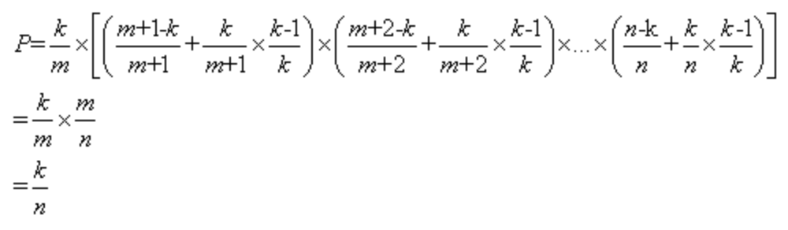

# 数学问题

## 主定理

## 基础解系

## 斐波拉契通项公式

## 求pi

> 方案1：

> 方案2：

## 蓄水池抽样

> **操作流程**：先把读到的前k个对象放入“水库”，对于第k+1个对象开始，以k/(k+1)的概率选择该对象，以k/(k+2)的概率选择第k+2个对象，以此类推，以k/m的概率选择第m个对象（m>k）。如果m被选中，则随机替换水库中的一个对象。最终每个对象被选中的概率均为k/n，
> **证明**：第m个对象被选中的概率=选择m的概率*（其后元素不被选择的概率+其后元素被选择的概率*不替换第m个对象的概率），即

