<!-- TOC -->

- [1. 理论](#1-%E7%90%86%E8%AE%BA)
  - [1.1. LDA](#11-LDA)
    - [1.1.1. 前言：pLSA](#111-%E5%89%8D%E8%A8%80pLSA)
    - [1.1.2. 原理](#112-%E5%8E%9F%E7%90%86)
    - [1.1.3. 实现细节](#113-%E5%AE%9E%E7%8E%B0%E7%BB%86%E8%8A%82)
  - [1.2. HMM和CRF](#12-HMM%E5%92%8CCRF)
    - [1.2.1. 基础知识](#121-%E5%9F%BA%E7%A1%80%E7%9F%A5%E8%AF%86)
      - [1.2.1.1. HMM](#1211-HMM)
      - [1.2.1.2. CRF](#1212-CRF)
    - [1.2.2. 具体实现](#122-%E5%85%B7%E4%BD%93%E5%AE%9E%E7%8E%B0)
      - [1.2.2.1. HMM](#1221-HMM)
      - [1.2.2.2. CRF](#1222-CRF)
      - [1.2.2.3. 参考链接](#1223-%E5%8F%82%E8%80%83%E9%93%BE%E6%8E%A5)
  - [1.3. 循环神经网络](#13-%E5%BE%AA%E7%8E%AF%E7%A5%9E%E7%BB%8F%E7%BD%91%E7%BB%9C)
    - [1.3.1. 递推式](#131-%E9%80%92%E6%8E%A8%E5%BC%8F)
      - [1.3.1.1. RNN](#1311-RNN)
      - [1.3.1.2. LSTM](#1312-LSTM)
      - [1.3.1.3. GRU](#1313-GRU)
      - [1.3.1.4. LSTM和GRU比较](#1314-LSTM%E5%92%8CGRU%E6%AF%94%E8%BE%83)
  - [1.4. 卷积神经网络](#14-%E5%8D%B7%E7%A7%AF%E7%A5%9E%E7%BB%8F%E7%BD%91%E7%BB%9C)
    - [1.4.1. 经典公式](#141-%E7%BB%8F%E5%85%B8%E5%85%AC%E5%BC%8F)
    - [1.4.2. 动机](#142-%E5%8A%A8%E6%9C%BA)
    - [1.4.3. 求导](#143-%E6%B1%82%E5%AF%BC)
  - [1.5. 注意力](#15-%E6%B3%A8%E6%84%8F%E5%8A%9B)
  - [1.6. 机器学习相关](#16-%E6%9C%BA%E5%99%A8%E5%AD%A6%E4%B9%A0%E7%9B%B8%E5%85%B3)
    - [1.6.1. LR](#161-LR)
    - [1.6.2. 决策树](#162-%E5%86%B3%E7%AD%96%E6%A0%91)
    - [1.6.3. SVM](#163-SVM)
    - [1.6.4. 最大熵模型（todo）](#164-%E6%9C%80%E5%A4%A7%E7%86%B5%E6%A8%A1%E5%9E%8Btodo)
    - [1.6.5. EM算法（todo）](#165-EM%E7%AE%97%E6%B3%95todo)
    - [1.6.6. 集成方法](#166-%E9%9B%86%E6%88%90%E6%96%B9%E6%B3%95)
      - [1.6.6.1. GBDT](#1661-GBDT)
      - [1.6.6.2. 随机森林](#1662-%E9%9A%8F%E6%9C%BA%E6%A3%AE%E6%9E%97)
      - [1.6.6.3. 比较](#1663-%E6%AF%94%E8%BE%83)
    - [1.6.7. 聚类算法](#167-%E8%81%9A%E7%B1%BB%E7%AE%97%E6%B3%95)
    - [1.6.8. 特征选择](#168-%E7%89%B9%E5%BE%81%E9%80%89%E6%8B%A9)
    - [1.6.9. 特征抽取](#169-%E7%89%B9%E5%BE%81%E6%8A%BD%E5%8F%96)
      - [1.6.9.1. PCA](#1691-PCA)
      - [1.6.9.2. 自编码器](#1692-%E8%87%AA%E7%BC%96%E7%A0%81%E5%99%A8)
      - [1.6.9.3. 线性判别分析](#1693-%E7%BA%BF%E6%80%A7%E5%88%A4%E5%88%AB%E5%88%86%E6%9E%90)
    - [1.6.10. 处理数据不均衡的问题](#1610-%E5%A4%84%E7%90%86%E6%95%B0%E6%8D%AE%E4%B8%8D%E5%9D%87%E8%A1%A1%E7%9A%84%E9%97%AE%E9%A2%98)
    - [1.6.11. 处理数据有噪声的问题](#1611-%E5%A4%84%E7%90%86%E6%95%B0%E6%8D%AE%E6%9C%89%E5%99%AA%E5%A3%B0%E7%9A%84%E9%97%AE%E9%A2%98)
    - [1.6.12. 模型评价](#1612-%E6%A8%A1%E5%9E%8B%E8%AF%84%E4%BB%B7)
      - [1.6.12.1. F1](#16121-F1)
        - [1.6.12.1.1. 准确率（accuracy）](#161211-%E5%87%86%E7%A1%AE%E7%8E%87accuracy)
        - [1.6.12.1.2. 精确率（precision）](#161212-%E7%B2%BE%E7%A1%AE%E7%8E%87precision)
        - [1.6.12.1.3. 召回率（recall）](#161213-%E5%8F%AC%E5%9B%9E%E7%8E%87recall)
        - [1.6.12.1.4. F1](#161214-F1)
      - [1.6.12.2. AUC](#16122-AUC)
      - [1.6.12.3. NDCG/MAP](#16123-NDCGMAP)
    - [1.6.13. 特征工程](#1613-%E7%89%B9%E5%BE%81%E5%B7%A5%E7%A8%8B)
      - [1.6.13.1. 类别特征的处理方式](#16131-%E7%B1%BB%E5%88%AB%E7%89%B9%E5%BE%81%E7%9A%84%E5%A4%84%E7%90%86%E6%96%B9%E5%BC%8F)
      - [1.6.13.2. target encode](#16132-target-encode)
      - [1.6.13.3. 威尔逊置信区间平滑](#16133-%E5%A8%81%E5%B0%94%E9%80%8A%E7%BD%AE%E4%BF%A1%E5%8C%BA%E9%97%B4%E5%B9%B3%E6%BB%91)
      - [1.6.13.4. 使用GBDT进行特征组合](#16134-%E4%BD%BF%E7%94%A8GBDT%E8%BF%9B%E8%A1%8C%E7%89%B9%E5%BE%81%E7%BB%84%E5%90%88)
    - [1.6.14. MLE V.S. MAP](#1614-MLE-VS-MAP)
    - [1.6.15. 损失函数理解](#1615-%E6%8D%9F%E5%A4%B1%E5%87%BD%E6%95%B0%E7%90%86%E8%A7%A3)
    - [1.6.16. 过拟合和欠拟合问题](#1616-%E8%BF%87%E6%8B%9F%E5%90%88%E5%92%8C%E6%AC%A0%E6%8B%9F%E5%90%88%E9%97%AE%E9%A2%98)
      - [1.6.16.1. 过拟合解决](#16161-%E8%BF%87%E6%8B%9F%E5%90%88%E8%A7%A3%E5%86%B3)
      - [1.6.16.2. 欠拟合解决](#16162-%E6%AC%A0%E6%8B%9F%E5%90%88%E8%A7%A3%E5%86%B3)
      - [1.6.16.3. 统计基础](#16163-%E7%BB%9F%E8%AE%A1%E5%9F%BA%E7%A1%80)
  - [1.7. 深度学习基础](#17-%E6%B7%B1%E5%BA%A6%E5%AD%A6%E4%B9%A0%E5%9F%BA%E7%A1%80)
    - [1.7.1. 激活函数](#171-%E6%BF%80%E6%B4%BB%E5%87%BD%E6%95%B0)
      - [1.7.1.1. sigmoid](#1711-sigmoid)
      - [1.7.1.2. tanh](#1712-tanh)
      - [1.7.1.3. Relu](#1713-Relu)
      - [1.7.1.4. Swish](#1714-Swish)
      - [1.7.1.5. Maxout](#1715-Maxout)
    - [1.7.2. 正则化](#172-%E6%AD%A3%E5%88%99%E5%8C%96)
    - [1.7.3. BatchNorm/LayerNorm/GroupNorm](#173-BatchNormLayerNormGroupNorm)
      - [1.7.3.1. Internal Covariate Shift：](#1731-Internal-Covariate-Shift)
      - [1.7.3.2. 通用的变换框架](#1732-%E9%80%9A%E7%94%A8%E7%9A%84%E5%8F%98%E6%8D%A2%E6%A1%86%E6%9E%B6)
      - [1.7.3.3. BatchNorm](#1733-BatchNorm)
      - [1.7.3.4. LayerNorm](#1734-LayerNorm)
      - [1.7.3.5. Normalize为什么有效](#1735-Normalize%E4%B8%BA%E4%BB%80%E4%B9%88%E6%9C%89%E6%95%88)
    - [1.7.4. 优化问题](#174-%E4%BC%98%E5%8C%96%E9%97%AE%E9%A2%98)
      - [1.7.4.1. 凸函数](#1741-%E5%87%B8%E5%87%BD%E6%95%B0)
      - [1.7.4.2. 凸优化和非凸优化问题](#1742-%E5%87%B8%E4%BC%98%E5%8C%96%E5%92%8C%E9%9D%9E%E5%87%B8%E4%BC%98%E5%8C%96%E9%97%AE%E9%A2%98)
      - [1.7.4.3. 梯度下降](#1743-%E6%A2%AF%E5%BA%A6%E4%B8%8B%E9%99%8D)
      - [1.7.4.4. 牛顿法](#1744-%E7%89%9B%E9%A1%BF%E6%B3%95)
    - [1.7.5. 优化器](#175-%E4%BC%98%E5%8C%96%E5%99%A8)
      - [1.7.5.1. 一阶动量](#1751-%E4%B8%80%E9%98%B6%E5%8A%A8%E9%87%8F)
      - [1.7.5.2. 二阶动量](#1752-%E4%BA%8C%E9%98%B6%E5%8A%A8%E9%87%8F)
      - [1.7.5.3. 一阶动量+二阶动量](#1753-%E4%B8%80%E9%98%B6%E5%8A%A8%E9%87%8F%E4%BA%8C%E9%98%B6%E5%8A%A8%E9%87%8F)
    - [1.7.6. 参数初始化方法](#176-%E5%8F%82%E6%95%B0%E5%88%9D%E5%A7%8B%E5%8C%96%E6%96%B9%E6%B3%95)
      - [1.7.6.1.](#1761)
      - [1.7.6.2. He初始化](#1762-He%E5%88%9D%E5%A7%8B%E5%8C%96)
    - [1.7.7. Dropout：](#177-Dropout)
    - [1.7.8. 参数搜索方法](#178-%E5%8F%82%E6%95%B0%E6%90%9C%E7%B4%A2%E6%96%B9%E6%B3%95)
- [2. 工具](#2-%E5%B7%A5%E5%85%B7)
  - [2.1. 爬虫](#21-%E7%88%AC%E8%99%AB)
    - [2.1.1. scrapy](#211-scrapy)
  - [2.2. 大数据](#22-%E5%A4%A7%E6%95%B0%E6%8D%AE)
- [3. project](#3-project)
  - [3.1. word2vec](#31-word2vec)
    - [3.1.1. 模型介绍](#311-%E6%A8%A1%E5%9E%8B%E4%BB%8B%E7%BB%8D)
    - [3.1.2. tricks](#312-tricks)
    - [3.1.3. 具体实现](#313-%E5%85%B7%E4%BD%93%E5%AE%9E%E7%8E%B0)
    - [3.1.4. 拓展](#314-%E6%8B%93%E5%B1%95)
      - [3.1.4.1. SVD based](#3141-SVD-based)
      - [3.1.4.2. Glove](#3142-Glove)
      - [3.1.4.3. Elmo](#3143-Elmo)
      - [3.1.4.4. Bert](#3144-Bert)
      - [3.1.4.5. XLNet](#3145-XLNet)
    - [3.1.5. 问题：](#315-%E9%97%AE%E9%A2%98)
  - [3.2. 语言模型](#32-%E8%AF%AD%E8%A8%80%E6%A8%A1%E5%9E%8B)
    - [3.2.1. ngram](#321-ngram)
    - [3.2.2. NNLM](#322-NNLM)
    - [3.2.3. RNN](#323-RNN)
    - [3.2.4. Transfomer](#324-Transfomer)
  - [3.3. NER](#33-NER)
    - [3.3.1. 经典深度模型框架(BiLSTM+CRF)](#331-%E7%BB%8F%E5%85%B8%E6%B7%B1%E5%BA%A6%E6%A8%A1%E5%9E%8B%E6%A1%86%E6%9E%B6BiLSTMCRF)
    - [3.3.2. 具体实现细节](#332-%E5%85%B7%E4%BD%93%E5%AE%9E%E7%8E%B0%E7%BB%86%E8%8A%82)
      - [3.3.2.1. loss计算](#3321-loss%E8%AE%A1%E7%AE%97)
      - [3.3.2.2. 解码](#3322-%E8%A7%A3%E7%A0%81)
    - [3.3.3. 对比CNN+CRF](#333-%E5%AF%B9%E6%AF%94CNNCRF)
  - [3.4. 排序模型](#34-%E6%8E%92%E5%BA%8F%E6%A8%A1%E5%9E%8B)
  - [3.5. 文本分类](#35-%E6%96%87%E6%9C%AC%E5%88%86%E7%B1%BB)
    - [3.5.1. TextCNN](#351-TextCNN)
    - [3.5.2. RCNN](#352-RCNN)
    - [3.5.3. BiLSTM](#353-BiLSTM)
    - [3.5.4. HAN](#354-HAN)
  - [3.6. 文本匹配](#36-%E6%96%87%E6%9C%AC%E5%8C%B9%E9%85%8D)
    - [3.6.1. WMD](#361-WMD)
    - [3.6.2. DSSM](#362-DSSM)

<!-- /TOC -->

# 1. 理论

## 1.1. LDA

### 1.1.1. 前言：pLSA

> 介绍：pLSA是用一个生成模型来建模文章的生成过程。假设有K个主题，M篇文章；对语料库中的任意文章d，假设该文章有N个词，则对于其中的每一个词，我们首先选择一个主题z，然后在当前主题的基础上生成一个词w。

<div align=center>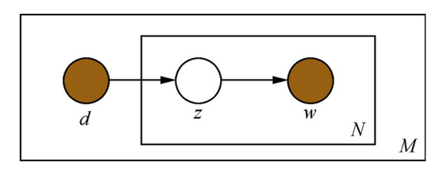</div>

> **公式**：
$$p(w|d)=\sum_zp(w|z,d)p(z|d)$$
- 假设：
$$p(w|z,d)=p(w|z)$$
- 似然函数：
$$L=\prod_m^M\prod_n^Np(w_m,d_n)^{c(w_m,d_n)}$$

> **训练**：EM算法

- **使用场景**：含有隐变量的概率模型  
- **推导**：  
    1. 含隐变量的极大似然函数为：
   $$L(\Theta)=logP(Y|\Theta)=log\sum_ZP(Y|Z,\Theta)P(Z|\Theta)$$  
    1. 设第i次迭代得到的参数为$\Theta^{(i)}$，则此时可以定义如下的函数，在第i+1步应该使下式最大化
   $$L=L(\Theta)-L(\Theta^{(i)})=log\sum_ZP(Y|Z,\Theta)P(Z|\Theta)-P(Y|\Theta^{(i)})$$
    1. 利用jesen不等式，可以得到上式下界:  
   $$
   \begin{aligned}
   L&=log\sum_ZP(Y|Z,\Theta)P(Z|\Theta)-P(Y|\Theta^{(i)}) \\
   &=log\sum_zP(Z|Y,\Theta^{(i)})\frac{P(Y|Z,\Theta)P(Z|\Theta)}{P(Z|Y,\Theta^{(i)})}-P(Y|\Theta^{(i+1)})\\
   &>=\sum_zP(Z|Y,\Theta^{(i)})log\frac{P(Y|Z,\Theta)P(Z|\Theta)}{P(Z|Y,\Theta^{(i)})}-P(Y|\Theta^{(i+1)})\\
   &=\sum_zP(Z|Y,\Theta^{(i)})log\frac{P(Y|Z,\Theta)P(Z|\Theta)}{P(Z|Y,\Theta^{(i)})P(Y|\Theta^{(i)})}\\
   \end{aligned}
   $$
   $$
   \begin{aligned}
   \Theta^{(i+1)}&=arg\max_{\Theta}L(\Theta) \Rightarrow \Theta^{(i+1)}=arg\max_{\Theta}\Big(L(\Theta^{(i)})+\sum_ZP(Z|Y,\Theta^{(i)})log\frac{P(Y|Z,\Theta)P(Z|\Theta)}{P(Z|Y,\Theta^{(i)})P(Y|\Theta^{(i)})}\Big)\\
   &\Rightarrow \Theta^{(i+1)}=arg\max_{\Theta}\Big(\sum_ZP(Z|Y,\Theta^{(i+1)})logP(Y|Z,\Theta)P(Z|\Theta)\Big)\\
   &\Rightarrow \Theta^{(i+1)}=arg\max_{\Theta}\Big(\sum_ZP(Z|Y,\Theta^{(i+1)})logP(Y,Z|\Theta))\Big)\\
   &\Rightarrow \Theta^{(i+1)}=arg\max_{\Theta}Q(\Theta,\Theta^{(i+1)})\\
   \end{aligned}
   $$

- **流程**：  
    1. 输入：观测变量数据Y，隐变量Z，联合分布$P(Y,Z|\Theta)$,条件分布$P(Z|Y,\Theta)$
    2. 输出：模型参数$\Theta$  
    3. 初始化：初始化$\Theta$为$\Theta^{(0)}$
    4. 迭代流程： 
       + E step:记$\Theta^{(i)}$为第i步迭代对$\Theta$的估计值，在i+1次迭代的E步，计算  
        $$Q(\Theta,\Theta^{(i)})=E_z[log(P(Y,Z|\Theta)|Y,\Theta^{(i)}]=\sum_z(logP(Y,Z|\Theta)P(Z|Y,\Theta^{(i)}))$$
       + M step:确定第i+1次参数迭代的值$\Theta^{(i+1)}$
        $$\Theta^{(i+1)}=arg\max_{\Theta}Q(\Theta,\Theta^{(i)})$$
       + 重复E step和M step，直到收敛。

### 1.1.2. 原理

> **与plsa关系**：LDA可以看作是pLSA的贝叶斯版本， 其文本生成过程与pLSA基本相同， 不同的是为主题分布和词分布分别加了两个狄利克雷（Dirichlet） 先验。

>> *频率学派与贝叶斯学派*：pLSA采用的是频率派思想， 将每篇文章对应的主题分布$p(z_k|d_m)$和每个主题对应的词分布$p(w_m|z_k)$看成确定的未知常数， 并可以求解出来； 而LDA采用的是贝叶斯学派的思想， 认为待估计的参数（主题分布和词分布） 不再是一个固定的常数， 而是服从一定分布的随机变量。 这个分布符合一定的先验概率分布（即狄利克雷分布） ， 并且在观察到样本信息之后， 可以对先验分布进行修正， 从而得到后验分布。

>> *狄利克雷先验*：LDA之所以选择狄利克雷分布作为先验分布， 是因为它为多项式分布的共轭先验概率分布，后验概率依然服从狄利克雷分布， 这样做可以为计算带来便利。 

> **概率图**：

<div align=center>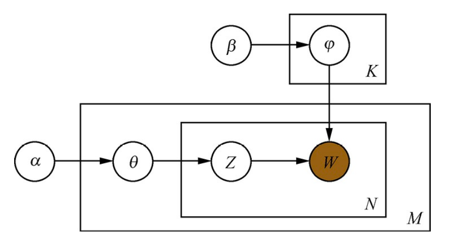</div>

> 文档生成过程

<div align=left>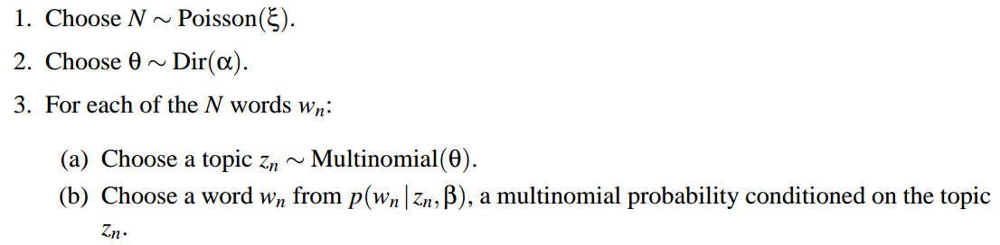</div>

> 参数

- 狄利克雷分布的参数（1*V）

> 分布

- 多项分布解释
<div align=left>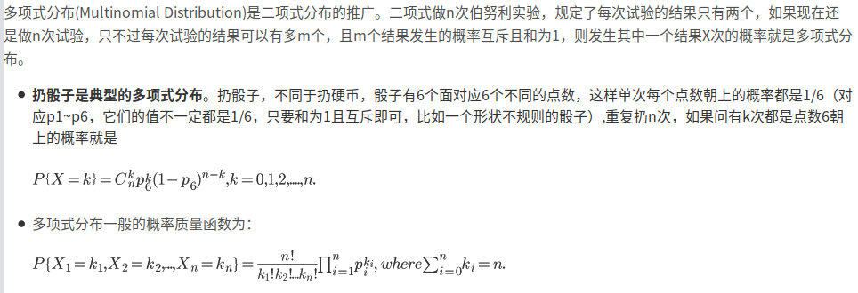</div>

- 狄利克雷分布
<div align=center>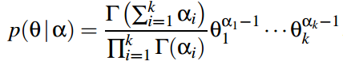</div>
狄利克雷分布与多项分布共轭关系的推导：

### 1.1.3. 实现细节

## 1.2. HMM和CRF

### 1.2.1. 基础知识
**HMM和CRF同属于概率图模型。**  
概率图模型分为贝叶斯网络（Bayesian Network） 和马尔可夫网络（Markov Network） 两大类。 贝叶斯网络可以用一个有向图结构表示， 马尔可夫网络可以表示成一个无向图的网络结构。更详细地说， 概率图模型包括了**朴素贝叶斯模型**、**最大熵模型**、**隐马尔可夫模型**、 **条件随机场**、 **主题模型**等， 在机器学习的诸多场景中都有着广泛的应用。

#### 1.2.1.1. HMM

> **简介**：HMM是一类贝叶斯网络。图示和联合概率分布如下：

<div align=center>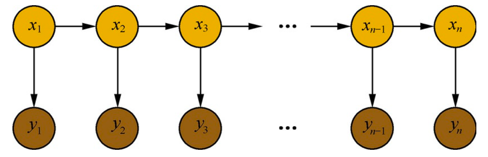</div>

> **两个基本假设**：
- 齐次马尔科夫假设
$$p(i_t|i_{1...t-1},o_{1...t-1})=p(i_t|i_{t-1})$$
- 观测独立性假设
$$p(o_t|i_t,i_{1...t-1},o_{1...t-1})=p(o_t|i_t)$$

> **三个基本问题**：
- 概率计算问题  
前向-后向算法。以前向算法为例。  
    1. 定义$\alpha_t(i)=p(o_1,o_2,...,o_t,i_t|\lambda)$，表示前t步的观测为$o_{1...t}$且t步状态为$i_t$的概率。  
    2. 算法：  

- 学习问题  
    1. 监督学习：频数计算即可  
    2. 非监督学习：Baul-Welch算法（也就是EM算法）  

- 预测问题:**维特比算法**


#### 1.2.1.2. CRF

### 1.2.2. 具体实现

#### 1.2.2.1. HMM

实现代码：

```python
# five elements for HMM
states = ('Healthy', 'Fever')
 
observations = ('normal', 'cold', 'dizzy')
 
start_probability = {'Healthy': 0.6, 'Fever': 0.4}
 
transition_probability = {
   'Healthy' : {'Healthy': 0.7, 'Fever': 0.3},
   'Fever' :   {'Healthy': 0.4, 'Fever': 0.6},
   }
 
emission_probability = {
   'Healthy' : {'normal': 0.5, 'cold': 0.4, 'dizzy': 0.1},
   'Fever'   : {'normal': 0.1, 'cold': 0.3, 'dizzy': 0.6},
   }

#动态规划
def Viterbit(obs, states, s_pro, t_pro, e_pro):
	path = { s:[] for s in states} # init path: path[s] represents the path ends with s
	curr_pro = {}
	for s in states:
		curr_pro[s] = s_pro[s]*e_pro[s][obs[0]]
	for i in range(1, len(obs)):
		last_pro = curr_pro
		curr_pro = {}
		for curr_state in states:
			max_pro, last_sta = max(((last_pro[last_state]*t_pro[last_state][curr_state]*e_pro[curr_state][obs[i]], last_state) 
				                       for last_state in states))
			curr_pro[curr_state] = max_pro
			path[curr_state].append(last_sta)
	# find the final largest probability
	max_pro = -1
	max_path = None
	for s in states:
		path[s].append(s)
		if curr_pro[s] > max_pro:
			max_path = path[s]
			max_pro = curr_pro[s]
		# print '%s: %s'%(curr_pro[s], path[s]) # different path and their probability
	return max_path


if __name__ == '__main__':
	obs = ['normal', 'cold', 'dizzy','cold']
	print(Viterbit(obs, states, start_probability, transition_probability, emission_probability))
```

流程：

<div align=center>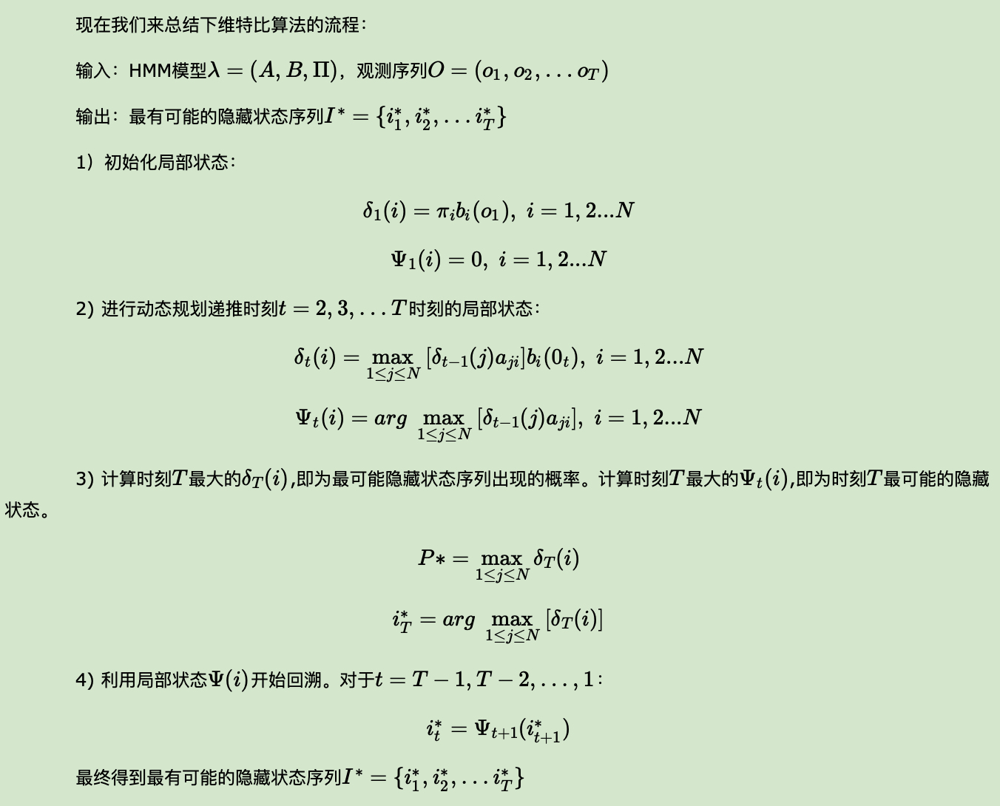</div>

#### 1.2.2.2. CRF

```python
# -*- coding:utf-8 -*-

from keras.layers import Layer
import keras.backend as K


class CRF(Layer):
    """纯Keras实现CRF层
    CRF层本质上是一个带训练参数的loss计算层，因此CRF层只用来训练模型，
    而预测则需要另外建立模型。
    """
    def __init__(self, ignore_last_label=False, **kwargs):
        """ignore_last_label：定义要不要忽略最后一个标签，起到mask的效果
        """
        self.ignore_last_label = 1 if ignore_last_label else 0
        super(CRF, self).__init__(**kwargs)
    def build(self, input_shape):
        self.num_labels = input_shape[-1] - self.ignore_last_label
        self.trans = self.add_weight(name='crf_trans',
                                     shape=(self.num_labels, self.num_labels),
                                     initializer='glorot_uniform',
                                     trainable=True)
    def log_norm_step(self, inputs, states):
        """递归计算归一化因子
        要点：1、递归计算；2、用logsumexp避免溢出。
        技巧：通过expand_dims来对齐张量。
        """
        states = K.expand_dims(states[0], 2) # (batch_size, output_dim, 1)
        trans = K.expand_dims(self.trans, 0) # (1, output_dim, output_dim)
        output = K.logsumexp(states+trans, 1) # (batch_size, output_dim)
        return output+inputs, [output+inputs]
    def path_score(self, inputs, labels):
        """计算目标路径的相对概率（还没有归一化）
        要点：逐标签得分，加上转移概率得分。
        技巧：用“预测”点乘“目标”的方法抽取出目标路径的得分。
        """
        point_score = K.sum(K.sum(inputs*labels, 2), 1, keepdims=True) # 逐标签得分
        labels1 = K.expand_dims(labels[:, :-1], 3)
        labels2 = K.expand_dims(labels[:, 1:], 2)
        labels = labels1 * labels2 # 两个错位labels，负责从转移矩阵中抽取目标转移得分
        trans = K.expand_dims(K.expand_dims(self.trans, 0), 0)
        trans_score = K.sum(K.sum(trans*labels, [2,3]), 1, keepdims=True)
        return point_score+trans_score # 两部分得分之和
    def call(self, inputs): # CRF本身不改变输出，它只是一个loss
        return inputs
    def loss(self, y_true, y_pred): # 目标y_pred需要是one hot形式
        mask = 1-y_true[:,1:,-1] if self.ignore_last_label else None
        y_true,y_pred = y_true[:,:,:self.num_labels],y_pred[:,:,:self.num_labels]
        init_states = [y_pred[:,0]] # 初始状态
        log_norm,_,_ = K.rnn(self.log_norm_step, y_pred[:,1:], init_states, mask=mask) # 计算Z向量（对数）
        log_norm = K.logsumexp(log_norm, 1, keepdims=True) # 计算Z（对数）
        path_score = self.path_score(y_pred, y_true) # 计算分子（对数）
        return log_norm - path_score # 即log(分子/分母)
    def accuracy(self, y_true, y_pred): # 训练过程中显示逐帧准确率的函数，排除了mask的影响
        mask = 1-y_true[:,:,-1] if self.ignore_last_label else None
        y_true,y_pred = y_true[:,:,:self.num_labels],y_pred[:,:,:self.num_labels]
        isequal = K.equal(K.argmax(y_true, 2), K.argmax(y_pred, 2))
        isequal = K.cast(isequal, 'float32')
        if mask == None:
            return K.mean(isequal)
        else:
            return K.sum(isequal*mask) / K.sum(mask)
```

#### 1.2.2.3. 参考链接

- https://zhuanlan.zhihu.com/p/28305337

## 1.3. 循环神经网络

### 1.3.1. 递推式

#### 1.3.1.1. RNN

> **公式**：

$$
\begin{aligned}
    Net_t &= Wh_{t-1}+Ux_t\\
    h_{t} &= f(net_t)
\end{aligned}
$$

> **问题**：
梯度计算公式：在算loss时会有很多以下单元的连乘，这可能导致梯度消失或梯度爆炸问题。

$$
\begin{aligned}
    \frac{dnet_t}{dnet_{t-1}}=\frac{dnet_t}{dh_{t-1}}\frac{dh_{t-1}}{dnet_{t-1}}=Wf^{'}(net_{t-1})
\end{aligned}
$$

  - **梯度消失**：借助lstm或gru的门控机制来解决。
  - **梯度爆炸**：借助梯度裁剪技术来解决。

#### 1.3.1.2. LSTM

$$
\begin{aligned}
    i_{t} &= sigmoid(W_ih_{t-1}+U_ix_t+b_i)\\
    o_{t} &= sigmoid(W_oh_{t-1}+U_ox_t+b_0)\\
    f_{t} &= sigmoid(W_fh_{t-1}+U_fx_t+b_f)\\
    \hat{c_{t}} &= tanh(W_ch_{t-1}+U_cx_t)\\
    c_{t} &= f_t*\hat{c_{t}}+i_t*x_t\\
    h_t &= o_t*tanh(c_t)
\end{aligned}
$$

#### 1.3.1.3. GRU

<div align=center>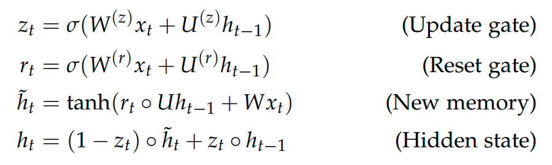</div>

#### 1.3.1.4. LSTM和GRU比较
- GRU和LSTM的性能在很多任务上不分伯仲。
- GRU 参数更少因此更容易收敛，但是数据集很大的情况下，LSTM表达性能更好。
- 从结构上来说，GRU只有两个门（update和reset），LSTM有三个门（forget，input，output），GRU直接将hidden state 传给下一个单元，而LSTM则用memory cell 把hidden state 包装起来。

## 1.4. 卷积神经网络

### 1.4.1. 经典公式

$$
S(i,j) = \sum_m\sum_nI(i+m,i+n)K(m,n)
$$

### 1.4.2. 动机

> **稀疏连接**：

> **参数共享**：

### 1.4.3. 求导

## 1.5. 注意力

## 1.6. 机器学习相关

### 1.6.1. LR

$$ P(y=1|x)=\frac{1}{1+e^{-(w^{T}x+b)}} $$
$$ P(y=0|x)=\frac{1}{1+e^{w^{T}x+b}} $$
> LR是对于$'y=1|x'$这一事件的**对数几率的线性回归**，几率$odd=\frac{p}{1-p}$

> **梯度计算**：对于0/1标签，使用极大似然估计，求logloss，记$\pi(i)=P(y=1|x_i)$
  - 似然函数：$$ L = \sum_{i=1}^{n}\pi(i)^{y_i}(1-\pi(i))^{1-y_i} $$
  - logloss：
  $$
  \begin{aligned}
    loss &= -log(L)\\
    &= \sum_{i=1}^{n}[y_iln\pi(i)+(1-y_i)ln(1-\pi(i))]\\
    &=\sum_{i=1}^{n}[ln(1-\pi(i))+y_iln(\frac{\pi(i)}{1-\pi(i)})]\\
    &=\sum_{i=1}^n[-ln(1+e^{w^Tx_i+b})+y_i(w^Tx_i+b)]
  \end{aligned}  
  $$

  - 导数：
  $$ 
  \begin{aligned}
  \frac{dloss}{w_j}&=\sum_{i=1}^{n}[x_{ij}y_i-(\frac{1}{1+e^{w^Tx_i+b}})(e^{w^Tx_i+b})x_{ij}]\\
  &=\sum_{i=1}^{n}[x_{ij}(y_i-\pi(i))]
  \end{aligned}
  $$
  $$ 
  \begin{aligned}
  \frac{dloss}{db}&=\sum_{i=1}^{n}[y_i-(\frac{1}{1+e^{w^Tx_i+b}})(e^{w^Tx_i+b})*1]\\
  &=\sum_{i=1}^{n}[y_i-\pi(i)]
  \end{aligned}
  $$

  #### LR常见面试问题

  - LR如何解决共线性，为什么深度学习不强调

  > 在多元线性回归模型经典假设中，其重要假定之一是回归模型的解释变量之间不存在线性关系，也就是说，解释变量X1，X2，……，Xk中的任何一个都不能是其他解释变量的线性组合。**如果违背这一假定，即线性回归模型中某一个解释变量与其他解释变量间存在线性关系，就称线性回归模型中存在多重共线性**。多重共线性违背了解释变量间不相关的古典假设，将给普通最小二乘法带来严重后果。

  > 解决方法：（1）l2正则（2）PCA降维去除相关性

  - LR分布式训练怎么做（行列同时切分）
  > - 按行聚合，求$w^Tx_i$
  > - 按列聚合，（1）小块内按列聚合（2）整体按列聚合。拼接输出梯度向量。

  - LR为什么不能使用MSE损失函数
  > LR使用sigmoid函数，如果采用MSE损失会导致损失函数是非凸的，存在多个局部最小值。

### 1.6.2. 决策树

> 基本概念

对于随机变量$x$，$p_i=P(x=x_i)$
  - 熵：描述随机变量的不确定性
  $$ H(x)=-\sum_{i=1}^{n}p_ilogp_i $$
  - 条件熵：随机变量$x$给定的条件下，随机变量$y$的不确定性
  $$ H(y|x)=-\sum_{i=1}^{n}p_iH(y|x=x_i) $$
  - 信息增益：得知特征$x$的信息而使得类$y$的信息的不确定性减少的程度。
  $$ g(x,y)=H(y)-H(y|x) $$

> 三种常见的决策树：ID3，C4.5，CART

决策树的生成就是不断的选择最优的特征对训练集进行划分，是一个递归的过程。
  - ID3
  ID3算法在选择根节点和各内部节点中的分支属性时，采用**信息增益**作为评价标准。**信息增益的缺点是倾向于选择取值较多的属性**，在有些情况下这类属性可能不会提供太多有价值的信息。
  - C4.5
  C4.5克服了ID3 仅仅能够处理离散属性的问题，以及信息增益偏向选择取值较多特征的问题，使用**信息增益比**来选择特征。**信息增益比 = 信息增益 / 划分前熵** 选择信息增益比最大的作为最优特征。
  - CART
  CART 与 ID3，C4.5 不同之处在于 CART 生成的树必须是**二叉树**。也就是说，无论是回归还是分类问题，无论特征是离散的还是连续的，无论属性取值有多个还是两个，内部节点只能根据属性值进行二分。
  CART 的全称是**分类与回归树（classification and regression tree）**。从这个名字中就应该知道，CART 既可以用于分类问题，也可以用于回归问题。
    - 回归树
    在确定划分后，每个划分的输出取划分区域样本的均值。为了确定最优划分，每次会遍历所有特征和划分点。
    - 分类树
    使用**Gini指数**最小化准则来选择特征并进行划分；Gini指数表示集合的不确定性，或者是不纯度。基尼指数越大，集合不确定性越高，不纯度也越大。这一点和熵类似。**另一种理解基尼指数的思路是，基尼指数是为了最小化误分类的概率**。
    $$ Gini(p)=1-\sum_{i=1}^{n}p_i^2 $$

> 比较
- ID3和C4.5为多叉树，而CART为二叉树
- Gini 指数 vs 熵
  - Gini 指数的计算不需要对数运算，更加高效；
  - Gini 指数更偏向于连续属性，熵更偏向于离散属性。

> 剪枝

决策树算法很容易过拟合（overfitting），**剪枝算法就是用来防止决策树过拟合**，提高泛化性能的方法，剪枝分为预剪枝与后剪枝。

- **预剪枝**：是指在决策树的生成过程中，对每个节点在划分前先进行评估，若当前的划分不能带来泛化性能的提升，则停止划分，并将当前节点标记为叶节点。

- **后剪枝**：是指先从训练集生成一颗完整的决策树，然后自底向上对非叶节点进行考察，若将该节点对应的子树替换为叶节点，能带来泛化性能的提升，则将该子树替换为叶节点。

### 1.6.3. SVM

> 三种情况
- **线性可分支持向量机**。当训练数据线性可分时，通过硬间隔最大化，学习到的一个线性分类器；
  - 函数间隔
  分离超平面$y=w^{T}x+b$，样本点（$x_{i},y_{i}$）,则函数间隔为：

  $$ \hat{\gamma_{i}}=y_{i}(w^{T}x_{i}+b) $$

  - 几何间隔 
  函数间隔的缺点是当$w^{T}$和$b$成倍增加时，超平面不变，但函数间隔会增加。因此有几何间隔：

  $$ \gamma_{i}=y_{i}(\frac{w^{T}x_{i}}{||w||}+\frac{b}{||w||}) $$

  1. 硬间隔最大化的优化问题：
  $$
  \begin{aligned}
  &\underset{w,b}{max}\gamma\\
  &s.t.y_{i}(\frac{w^{T}x_{i}}{||w||}+\frac{b}{||w||})>=\gamma,i=1,2,...,n
  \end{aligned}
  $$
  可以转化成：
  $$
  \begin{aligned}
  &\underset{w,b}{min}\frac{1}{2}||w||^2\\
  &s.t.y_{i}(w^{T}x_{i}+b)>=1,i=1,2,...,n
  \end{aligned}
  $$
  2. 拉格朗日对偶问题
  使用拉格朗日乘子法，原始问题等价于如下极小极大问题：
  $$
  \begin{aligned}
  &\underset{w,b}{min}\underset{\alpha}{max}L(w,b,\alpha)\\
  &s.t.\alpha_i>=0\\
  &L(w,b,\alpha)=\frac{1}{2}||w||^2+\sum_{i=1}^{n}\alpha_i(1-y_{i}(w^{T}x_{i}+b))
  \end{aligned}
  $$
  对偶问题：极大极小问题
  $$ \underset{\alpha}{max}\underset{w,b}{min}L(w,b,\alpha) $$
     - 极小：
     $$ \frac{dL(w,b,\alpha)}{dw}=0 $$
     $$ \frac{dL(w,b,\alpha)}{db}=0 $$
     可以得到：
     $$ w=\sum_{i=1}^{n}\alpha_iy_ix_i $$
     $$ \sum_{i=1}^{n}\alpha_iy_i=0 $$
     - 极大：
     代入$L(w,b,\alpha)$可得对偶最优化问题：
     $$
     \begin{aligned}
     &\underset{\alpha}{min}\frac{1}{2}\sum_{i}\sum_{j}\alpha_{i}\alpha_{j}y_iy_jx_i*x_j-\sum_{i}\alpha_i\\
     &s.t.\sum_{i=1}^{n}\alpha_iy_i=0\\
     &\alpha_i>=0,i=1,2,...n
     \end{aligned}
     $$
  > 求得对偶最优化问题后，即可求得原始问题的解。**这样的优点一是对偶问题一般更好解，二是可以自然地引入核函数，处理线性不可分的问题**。

  > KKT条件：Todo

- **线性支持向量机**。当训练数据近似线性可分时，通过软间隔最大化，学习到的一个线性分类器。
  1. 软件隔最大化问题
  2. 合叶损失（hinge loss）
- **非线性支持向量机**。当训练数据线性不可分，通过使用核技巧及软间隔最大化，学习非线性支持向量机。

> 常见问题：

- SVM损失函数
- SVM怎么多分类
- SVM和LR比较

### 1.6.4. 最大熵模型（todo）

最大熵算法和LR算法的区别

### 1.6.5. EM算法（todo）

### 1.6.6. 集成方法

#### 1.6.6.1. GBDT

- GBDT与传统Boosting（AdaBoost）的区别
  - Boosting算法，但与传统boosting有区别、拟合上一步的残差，传统意义上说不能并行，只能用CART回归树，降低偏差
  - 迭代思路不同：传统boosting对训练样本进行加权，GBDT则是拟合残差，下一棵树沿残差梯度下降的方向进行拟合

- 实现方式
  函数空间的梯度下降。
  <div align=center>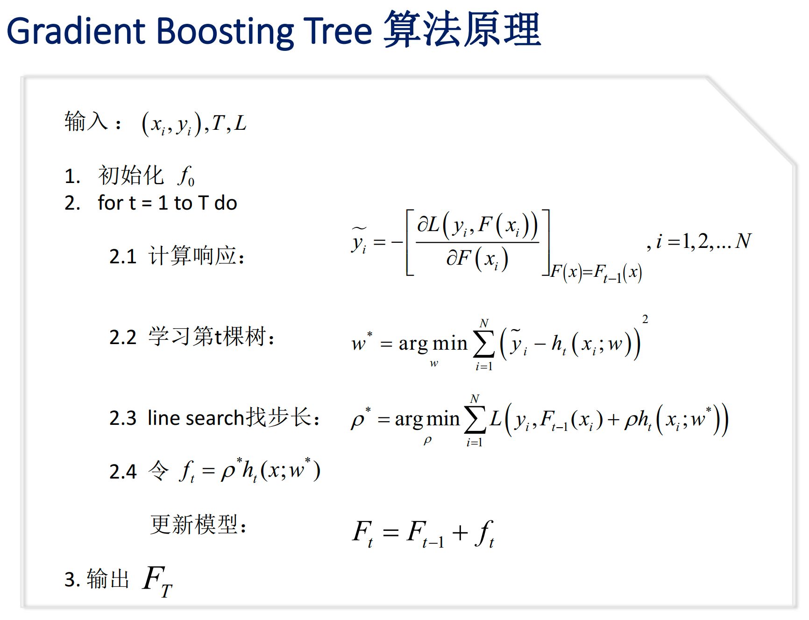</div>
  

#### 1.6.6.2. 随机森林

- 随机森林（Random Forest）是Bagging的一个变体。对每个基决策树，通过随机选择一部分样本和随机选择一部分特征进行学习，最后再通过加权或者投票的方式输出最后的预测结果。其中引入随机性的主要目的是防止过拟合。

#### 1.6.6.3. 比较
- GBDT 和随机森林的相同点：
都是由多棵树组成；最终的结果都由多棵树共同决定。
- GBDT 和随机森林的不同点：
  1. 组成随机森林的可以是分类树、回归树；组成 GBDT 只能是回归树；
  2. 组成随机森林的树可以并行生成（Bagging）；GBDT 只能串行生成（Boosting）；这两种模型都用到了Bootstrap的思想。
  3. 对于最终的输出结果而言，随机森林使用多数投票或者简单平均；而 GBDT 则是将所有结果累加起来，或者加权累加起来；
  4. 随机森林对异常值不敏感，GBDT 对异常值非常敏感；
  5. 随机森林对训练集一视同仁权值一样，GBDT 是基于权值的弱分类器的集成；
  6. 随机森林通过减小模型的方差提高性能，GBDT 通过减少模型偏差提高性能。
- GBDT v.s. XGBoost v.s. LightGbm

### 1.6.7. 聚类算法

> **Kmeans**
- 算法流程

<div align=center>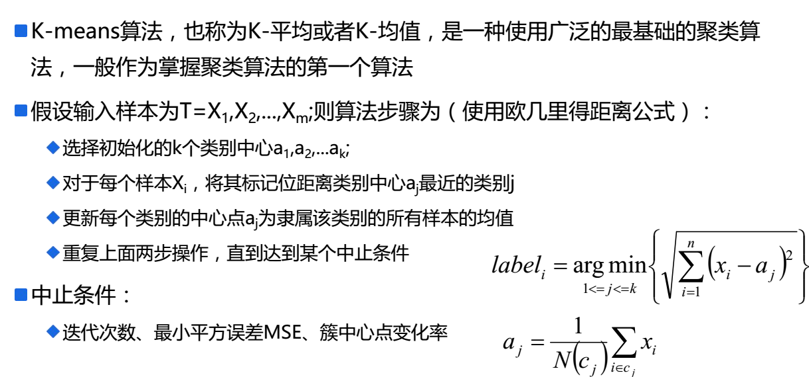</div>

- 问题
  - **异常值敏感**：K-means算法在迭代的过程中使用所有点的均值作为新的质点(中心点),如果簇中存在异常点,将导致均值偏差比较严重。例如：一个簇中有2、4、6、8、100五个数据,那么新的质点为24,显然这个质点离绝大多数点都比较远;在当前情况下,使用中位数6可能比使用均值的想法更好,使用中位数的聚类方式叫做K- Mediods聚类(K中值聚类)

  - **初值敏感**：K-means算法是初值敏感的,选择不同的初始值可能导致不同的簇划分规则。为了避免这种敏感性导致的最终结果异常性,可以采用初始化多套初始节点构造不同的分类规则,然后选择最优的构造规则。

> **DBSCAN**

- **算法流程**

  1. 从任一对象点p开始；
  2. 寻找并合并核心p对象直接密度可达（eps）的对象； 
  3. 如果p是一个核心点，则找到了一个聚类，如果p是一个边界点（即从p没有密度可达的点）则寻找下一个对象点； 
  4. 重复2、3，直到所有点都被处理

> **层次聚类**

- **简介**：
  根据层次分解的顺序是自底向上的还是自上向下的，层次聚类算法分为**凝聚的层次聚类算法**和**分裂的层次聚类算法**。凝聚型层次聚类的策略是先将每个对象作为一个簇，然后合并这些原子簇为越来越大的簇，直到所有对象都在一个簇中，或者某个终结条件被满足。绝大多数层次聚类属于凝聚型层次聚类

- **算法流程（凝聚）**：
  1. 将每个对象看作一类，计算两两之间的最小距离；
  2. 将距离最小的两个类合并成一个新类；
  3. 重新计算新类与所有类之间的距离；
  4. 重复2、3，直到所有类最后合并成一类。

- **簇间距离度量**：
  - 最小距离
  - 最大距离
  - 均值距离
  - 距离均值 

- **优缺点**：
  - 优点：适合聚类数较多的情况
  - 缺点：计算复杂度高

> **聚类算法评估**

- 均一性：
- 兰德系数：
- 轮廓系数

> **聚类算法比较**

<div align=center>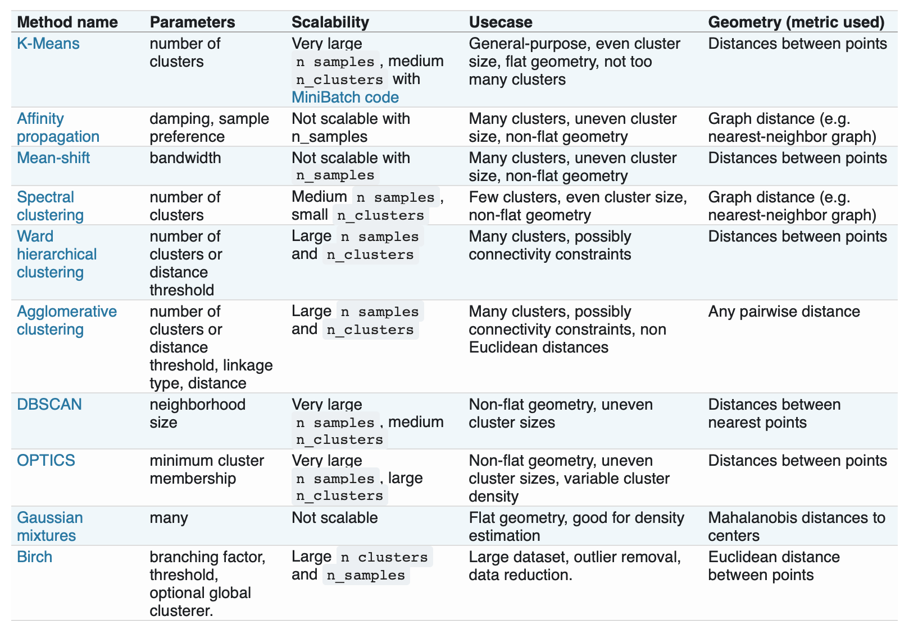</div>

### 1.6.8. 特征选择

> **过滤式选择**：

**过滤式（filter）方法不依赖具体的机器学习模型**。每次增加最有信息量的特征，或删除最没有信息量的特征。信息量可以通过信息增益（information gain）来衡量.

> **包裹式选择**：

**包裹式（wrapper）方法是用后续机器学习模型的准确率来评价一个特征子集**。每次增加对后续机器学习模型最有用的特征，或删除对后续机器学习任务最无用的特征。这种方法是将机器学习模型包裹到特征选择过程的内部。

> **嵌入式选择**：

### 1.6.9. 特征抽取

<div align=center>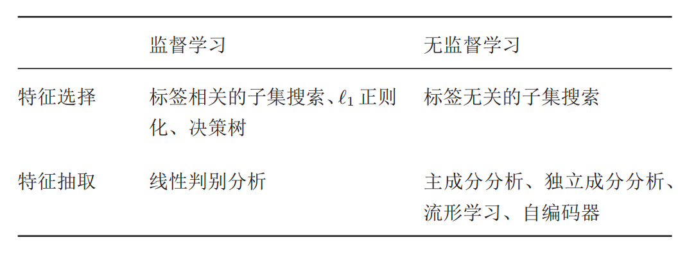</div>

#### 1.6.9.1. PCA

#### 1.6.9.2. 自编码器

#### 1.6.9.3. 线性判别分析

### 1.6.10. 处理数据不均衡的问题

- 基于数据的方法

  1. 重采样：
     + 随机重采样：对于样本数较少的类别进行有放回的采样。问题是会显著提升训练的时间，并且会带来过拟合的问题。
     + smote算法：对于每个少数类样本都生成一些新样本。具体步骤是从样本x的k邻近中随机选择一个样本y，然后在x到y的连线上随机生成一个新样本。

  2. 欠采样
     + 随机欠采样：对于样本数较多的类别进行随机采样。问题是会损失一些样本信息。
     + Informed Undersampling：
       + （1） Easy Ensemble算法。 每次从多数类$S_{maj}$中上随机抽取一个子集E($|E|=|S_{min}|$)， 然后用$E+S_{min}$训练一个分类器； 重复上述过程若干次， 得到多个分类器，最终的分类结果是这多个分类器结果的融合
       + （2） Balance Cascade算法。 **级联结构**， 在每一级中从多数类$S_{maj}$中随机抽取子集E， 用$E+S_{min}$训练该级的分类器； 然后将$S_{maj}$中能够被当前分类器正确判别的样本剔除掉， 继续下一级的操作， 重复若干次得到级联结构； 最终的输出结果也是各级分类器结果的融合

- 基于算法的方法
  1. 对不同类别的损失进行加权。
  2. 单类学习
  3. 异常检测   

### 1.6.11. 处理数据有噪声的问题


### 1.6.12. 模型评价

#### 1.6.12.1. F1

##### 1.6.12.1.1. 准确率（accuracy）
$$ accuracy = \frac{预测正确数}{样本总数} $$

##### 1.6.12.1.2. 精确率（precision）
$$ precision = \frac{预测正确的正样本数}{模型预测的正样本总数} $$

##### 1.6.12.1.3. 召回率（recall）
$$ recall = \frac{预测正确的正样本数}{真正的正样本总数} $$

##### 1.6.12.1.4. F1
$$ F1 = \frac{2*precision*recall}{precision+recall} $$

#### 1.6.12.2. AUC

- ROC曲线是Receiver Operating Characteristic Curve的简称。ROC曲线的横坐标为假阳性率（**False Positive Rate， FPR**）；纵坐标为真阳性率（**True Positive Rate， TPR**）。FPR和TPR的计算方法分别为
$$ FPR=\frac{FP}{N} $$
$$ TPR=\frac{TP}{P} $$

- 事实上，ROC曲线是通过不断移动分类器的“**截断点**”来生成曲线上的一组关键点的。**AUC指的是ROC曲线下的面积大小**，该值能够量化地反映基于ROC曲线衡量出的模型性能。

#### 1.6.12.3. NDCG/MAP

### 1.6.13. 特征工程

#### 1.6.13.1. 类别特征的处理方式
- one-hot
- 序列编码
- 二进制编码

#### 1.6.13.2. target encode

#### 1.6.13.3. 威尔逊置信区间平滑

#### 1.6.13.4. 使用GBDT进行特征组合

### 1.6.14. MLE V.S. MAP

### 1.6.15. 损失函数理解

- 分类问题的损失函数
  $$ y\in\{-1,+1\} $$

  <div align=center>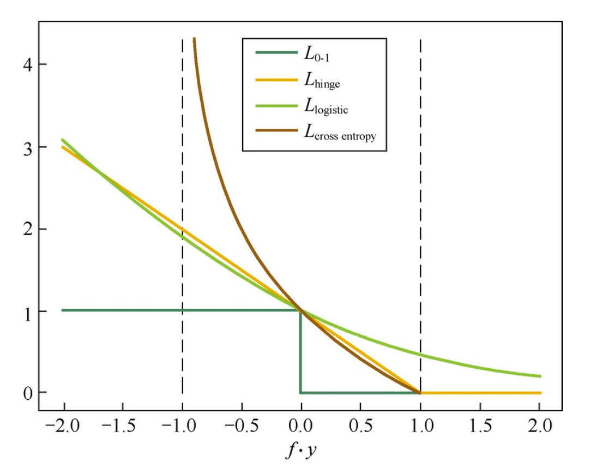</div>

  - 真实损失函数：0-1损失
  
  <div align=center>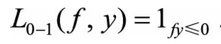</div>

  - 代理损失函数：
    1. **hinge loss**：也叫合叶损失函数，对分类器的要求更严格，但是在fy=1时不可导，需要使用**次梯度下降法**求解
    <div align=center>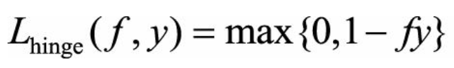</div>

    > 次梯度下降法：
    

    1. **logistic loss**：LR的损失函数
    <div align=center>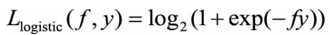</div>

    1. **交叉熵损失**：多分类的损失函数
    <div align=center>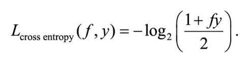</div>

    > 交叉熵和相对熵：
    >- 相对熵又称KL散度，是度量两个分布的距离。交叉熵与相对熵相差一个常量。
    <div align=center>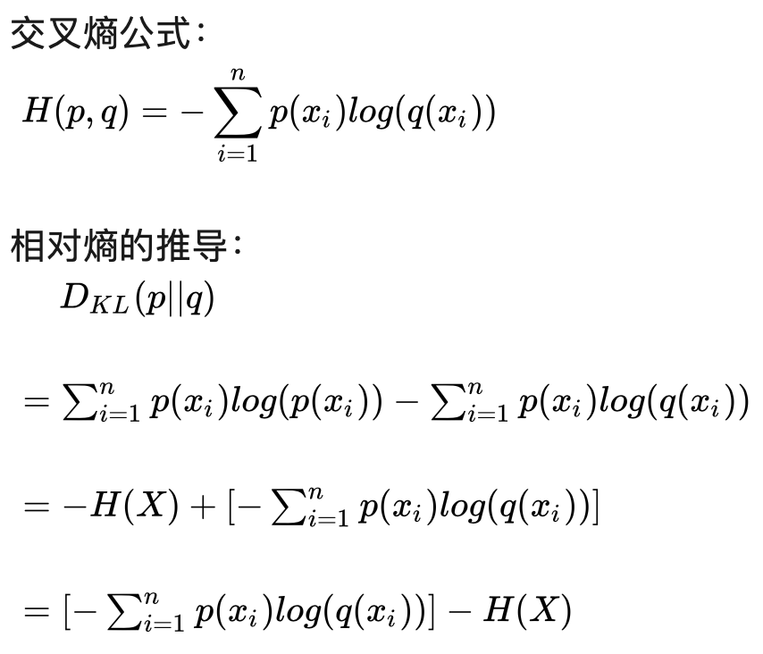</div>

- 回归问题的损失函数
  - **MSE**：平方损失函数，对异常值比较敏感
  - **MAP**：比平方损失函数鲁棒一点，但是在0点处不可导
  - **Huber**：兼顾鲁棒性和可导性
  <div align=center>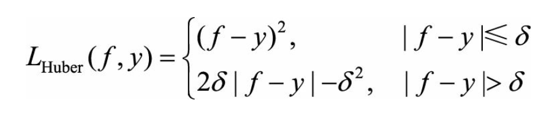</div>

### 1.6.16. 过拟合和欠拟合问题

#### 1.6.16.1. 过拟合解决
- 增加训练数据---如**数据增强**
- 降低模型复杂度---如**模型压缩**
- 正则化
- 模型融合---如bagging
- dropout
- batchnorm

> **数据增强**
> - nlp数据增强

> **模型压缩**
> - 知识蒸馏

#### 1.6.16.2. 欠拟合解决
- 增加模型复杂度
- 添加新特征：在深度学习潮流中， 有很多模型可以帮助完成特征工程，如因子分解机、 梯度提升决策树、 Deep-crossing等都可以成为丰富特征的方法。
- 降低正则化系数

#### 1.6.16.3. 统计基础

- 显著性检验
- 置信区间

## 1.7. 深度学习基础

### 1.7.1. 激活函数

#### 1.7.1.1. sigmoid

<div align=center>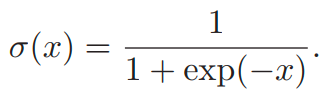</div>

- 问题1：Logistic函数的输出恒大于0。非零中心化的输出使得其后一层的神经元的输入发生**偏置偏移（Bias Shift）**，并进一步使得梯度下降的收敛速度变慢
- 问题2：进入饱和区后容易出现梯度消失问题

#### 1.7.1.2. tanh

<div align=center>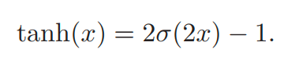</div>

- sigmoid和tanh比较

<div align=center></div>

#### 1.7.1.3. Relu

<div align=center>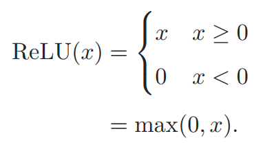</div>

- 缺点1: ReLU 函数的输出是非零中心化的，给后一层的神经网络引入偏置偏移，会影响梯度下降的效率。
- 缺点2：ReLU神经元在训练时比较容易“死亡”。在训ReLU 神经元指采用 ReLU练时，如果参数在一次不恰当的更新后，第一个隐藏层中的某个ReLU神经元在所有的训练数据上都不能被激活，那么这个神经元自身参数的梯度永远都会是0，在以后的训练过程中永远不能被激活，这种现象称为死亡ReLU问题。

> 针对relu的一些改进：
> - LeakyRelu
> - ELU
> - softplus

<div align=center>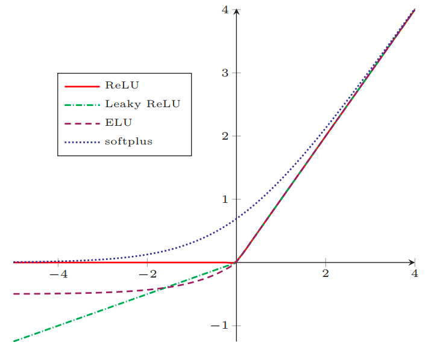</div>

#### 1.7.1.4. Swish

- Swish 函数是一种自门控（Self-Gated）激活函数 [Ramachandran 2017]，定义为

<div align=center>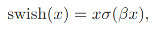</div>

- 当$\beta=0$时， Swish函数变成线性函数$x/2$。当$\beta = 1$时， Swish函数在$x > 0$时近似线性，在$x < 0$时近似饱和，同时具有一定的非单调性。**当$\beta → +\infty$时，$\sigma(\beta{x})$趋向于离散的0-1函数， Swish函数近似为ReLU函数**。因此， Swish函数可以看作是线性函数和ReLU函数之间的非线性插值函数，其程度由参数$\beta$控制。

<div align=center>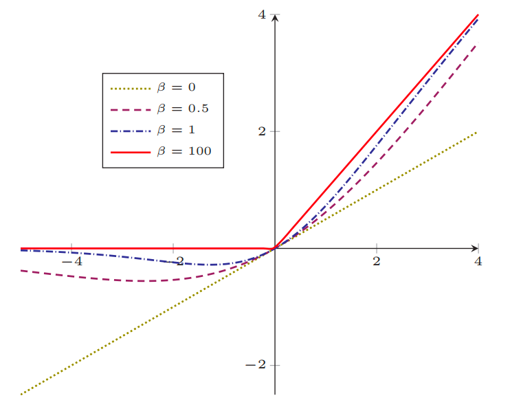</div>

#### 1.7.1.5. Maxout

Maxout单元[Goodfellow et al., 2013]也是一种分段线性函数。Sigmoid型、 ReLU 等激活函数的输入是神经元的净输入z，是一个标量。而maxout的输入是上一层神经元的全部原始输入，是一个向量$x = [x1; x2; · · · , xd]$。Maxout激活函数可以看作任意凸函数的分段线性近似，但是总体参数量多了很多。

### 1.7.2. 正则化

### 1.7.3. BatchNorm/LayerNorm/GroupNorm

可参考知乎专栏：https://zhuanlan.zhihu.com/p/33173246

#### 1.7.3.1. Internal Covariate Shift：

<div align=center>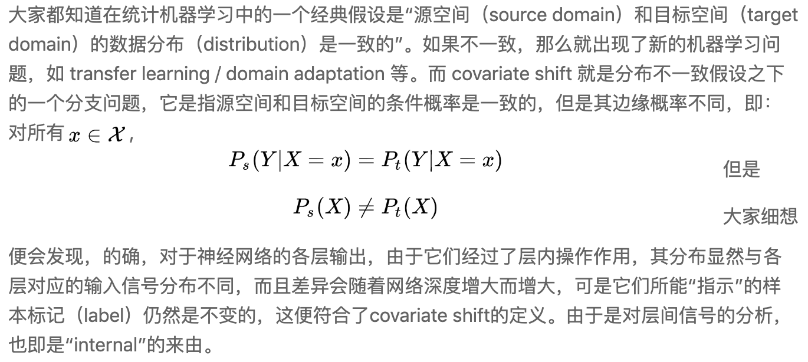</div>

- **ICS的问题**：

  简而言之，每个神经元的输入数据不再是“独立同分布”。
  - 其一，上层参数需要不断适应新的输入数据分布，降低学习速度。
  - 其二，下层输入的变化可能趋向于变大或者变小，导致上层落入饱和区，使得学习过早停止。
  - 其三，每层的更新都会影响到其它层，因此每层的参数更新策略需要尽可能的谨慎。

#### 1.7.3.2. 通用的变换框架

$$ h = f(g\frac{x-\mu}{\sigma}+b) $$

在将$x$送给神经元之前，先对其做平移和伸缩变换，将$x$的分布规范化成在固定区间范围的标准分布。

#### 1.7.3.3. BatchNorm

<div align=center>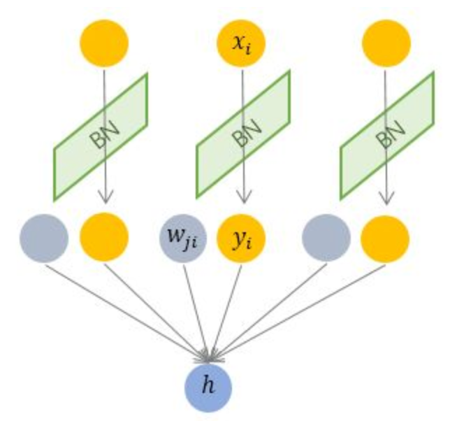</div>

规范化针对单个神经元进行，利用网络训练时一个mini-batch的数据来计算该神经元$x_i$的均值和方差,因而称为Batch Normalization。

$$
\begin{aligned}
\mu_i &= \frac{1}{n}\sum{x_i} \\
\sigma_i &= \sqrt{\frac{1}{n}\sum(x_i-\mu_i)^2+\epsilon}
\end{aligned}
$$

BN 独立地规范化每一个输入维度$x_i$，但规范化的参数是一个mini-batch的一阶统计量和二阶统计量。这就要求每一个mini-batch的统计量是整体统计量的近似估计，或者说每一个mini-batch彼此之间，以及和整体数据，都应该是近似同分布的

> **适用条件**：每个mini-batch比较大，数据分布比较接近。在进行训练之前，要做好充分的 shuffle. 否则效果会差很多。

> **训练和测试**：

> **梯度计算**：

#### 1.7.3.4. LayerNorm

<div align=center>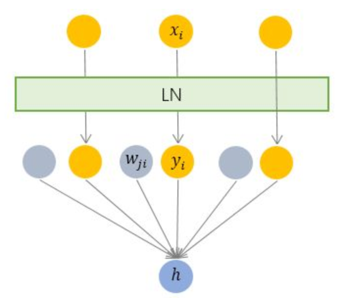</div>

层规范化就是针对 BN 的上述不足而提出的。与 BN 不同，LN 是一种横向的规范化，如图所示。它综合考虑一层所有维度的输入，计算该层的平均输入值和输入方差，然后用同一个规范化操作来转换各个维度的输入。

- **优点**：LN针对单个训练样本进行，不依赖于其他数据，因此可以避免BN中受mini-batch数据分布影响的问题，可以用于**小mini-batch场景、动态网络场景和RNN**，特别是自然语言处理领域。此外，LN 不需要保存mini-batch的均值和方差，节省了额外的存储空间。

- **缺点**：BN的转换是针对单个神经元可训练的——不同神经元的输入经过再平移和再缩放后分布在不同的区间，而LN对于一整层的神经元训练得到同一个转换——所有的输入都在同一个区间范围内。**如果不同输入特征不属于相似的类别（比如颜色和大小），那么LN的处理可能会降低模型的表达能力**。

#### 1.7.3.5. Normalize为什么有效


### 1.7.4. 优化问题

#### 1.7.4.1. 凸函数
<div align=center>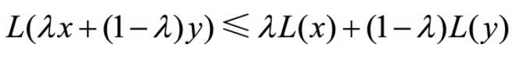</div>

#### 1.7.4.2. 凸优化和非凸优化问题
可以通过计算目标函数的二阶Hessian矩阵来验证凸性
- 凸优化问题：SVM，线性回归
- 非凸优化问题：PCA，矩阵分解，神经网络

#### 1.7.4.3. 梯度下降
通过一阶泰勒近似和l2正则项，可以得到：
<div align=center>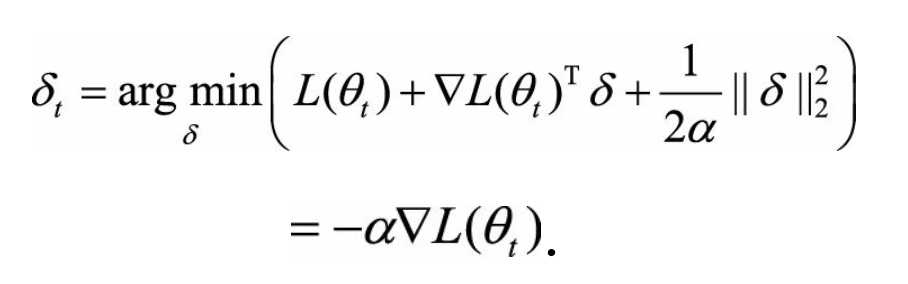</div>

#### 1.7.4.4. 牛顿法
通过二阶梯度近似
<div align=center>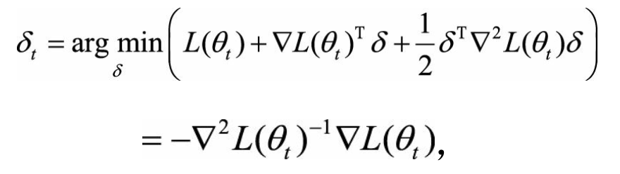</div>
由于计算复杂度比较高，后续有BFGS等改进

### 1.7.5. 优化器

#### 1.7.5.1. 一阶动量

#### 1.7.5.2. 二阶动量

#### 1.7.5.3. 一阶动量+二阶动量

### 1.7.6. 参数初始化方法

#### 1.7.6.1.  

#### 1.7.6.2. He初始化
  
### 1.7.7. Dropout：
dropout一般在激活函数之后，需要实验比较
> dropout的理解方式：

### 1.7.8. 参数搜索方法

- 网格搜索

- 随机搜索

- 贝叶斯搜索

# 2. 工具

## 2.1. 爬虫

### 2.1.1. scrapy

- 教程

## 2.2. 大数据

- map reduce

# 3. project

## 3.1. word2vec

### 3.1.1. 模型介绍

- cbow：用周围词来预测中心词。概率计算通过点积和softmax，上下文向量是周围所有词的平均词向量。损失函数是交叉熵损失。

<div align=center></div>

- skip-gram：用中心词来预测周围词，计算方式与cbow类似。

<div align=center></div>

### 3.1.2. tricks

> 由于softmax是针对整个词库进行操作的，每次更新都要对所有词的词向量进行更新，时间复杂度O(V)。因此采取负采样和层次softmax进行加速。

1. 负采样：定义新的损失函数加速计算。对于词对定义一个新的概率来表示该词对是否是真的从语料库中得到的。

<div align=center></div>

通过对每个词对中的上下文词或者中心词进行替换可以得到一些负样本，从而优化目标为：
- skip-gram   
  <div align=center>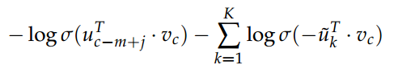</div>

- cbow 
  <div align=center></div>
- **remark**：负样本采样的经验规律，词频的0.75次方。


2. 层次softmax：是对原始softmax的改进。采用huffman树来加速计算的实现，方式是使高频词的路径更短。

<div align=center></div>

修改概率计算公式为：

<div align=center></div>

其中[]的意义如下，这使得所有词的概率和为1。

<div align=center></div>

如上图的huffman数可以得到对w2的概率公式为：

<div align=center>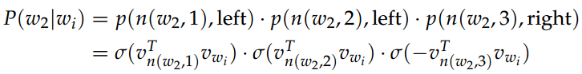</div>

> 这种方法的速度取决于二叉树的构造方式和单词分配给叶节点.Mikolov等使用二叉霍夫曼树，为频繁的单词指定较短的路径。

> **霍夫曼树建树**
> 叶节点的权重是单词的频率。选择权重最小的两个节点建树，将父节点加入候选节点继续生成。一般借助堆来实现。

### 3.1.3. 具体实现

### 3.1.4. 拓展

#### 3.1.4.1. SVD based
使用全局的统计信息，在词类比任务上表现不佳
> SVD基础：
> 
- word-document matrix：$ R^{V*N}(V>>N) $

- word-word matrix：$ R^{N*N} $

> 对上述两种矩阵使用**SVD分解**即可得到单词的低维稠密表示。同时这些方法存在明显的问题：
> 1. 矩阵大小容易变化
> 2. 矩阵高维稀疏
> 3. SVD分解的复杂度高，$O(mn^2)$
> 4. 需要处理共现频次的高度不平衡
>> 一些简单的改进：
>> 1. 去除停用词
>> 2. 对共现单词的距离进行加权
>> 3. 使用规范化并将负值置0

#### 3.1.4.2. Glove

#### 3.1.4.3. Elmo

#### 3.1.4.4. Bert

#### 3.1.4.5. XLNet

### 3.1.5. 问题：
1. fasttext和word2vec比较
2. bert fine-tune模式如何防止过拟合

## 3.2. 语言模型

### 3.2.1. ngram

2-gram和3-gram的公式如下：
<div align=center>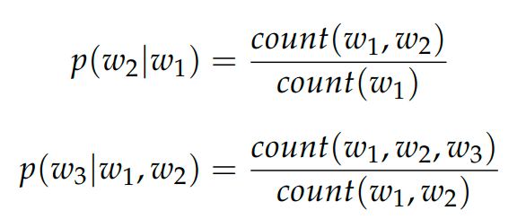</div>
主要缺点是：

- **稀疏性**
一些ngram组合在语料中没有出现。解决方法一是smoothing，如laplace smoothing即是对count值加1；二是backoff，即将n-gram回退成(n-1)-gram和(n-2)-gram等等。
- **存储问题**
需要存储$|V|^n$个概率值。一般n取4或5效果较好，但是空间复杂度很高。

### 3.2.2. NNLM

<div align=center>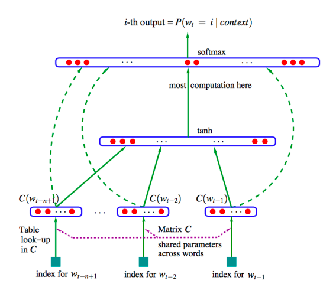</div>

简单的神经语言模型，主要是为了缓解ngram模型的维数灾难问题。在NNLM模型中，参数数量在embedding层和输出层，总共为$|V|*f+c*f*|V|$。参数数量随着词库的大小线性增长。
window-based语言模型。

### 3.2.3. RNN

<div align=center>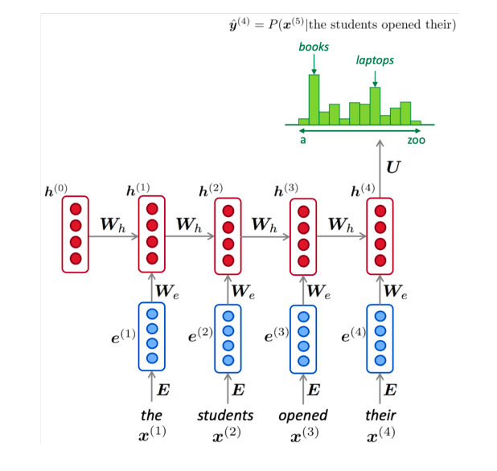</div>
相对于NNLM这种window-based的语言模型，RNN可以建模历史所有的单词信息。

- **RNN递推公式**
<div align=center>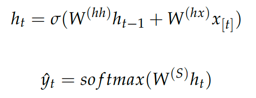</div>

- **RNN Loss and Perplexity**
  计算所有时间步的交叉熵损失
  <div align=center>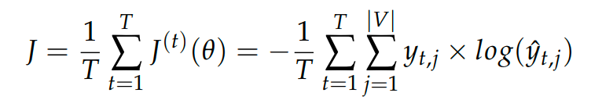</div>
  基于损失函数计算困惑度
  <div align=center>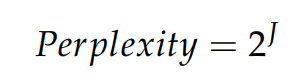</div>

- RNN的梯度消失/梯度爆炸问题


### 3.2.4. Transfomer

## 3.3. NER

### 3.3.1. 经典深度模型框架(BiLSTM+CRF)

<div align=center>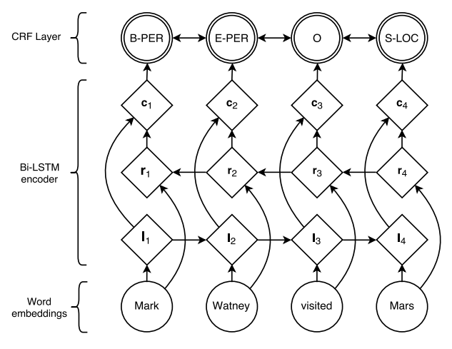</div>

### 3.3.2. 具体实现细节

#### 3.3.2.1. loss计算

score:其中

<div align=center>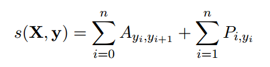</div>

loss:

<div align=center>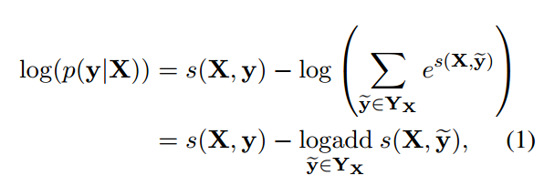</div>

#### 3.3.2.2. 解码

### 3.3.3. 对比CNN+CRF

## 3.4. 排序模型

## 3.5. 文本分类

### 3.5.1. TextCNN

### 3.5.2. RCNN

### 3.5.3. BiLSTM

### 3.5.4. HAN

## 3.6. 文本匹配

### 3.6.1. WMD

### 3.6.2. DSSM


