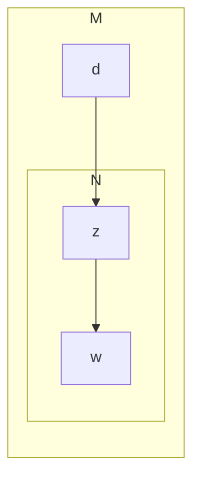
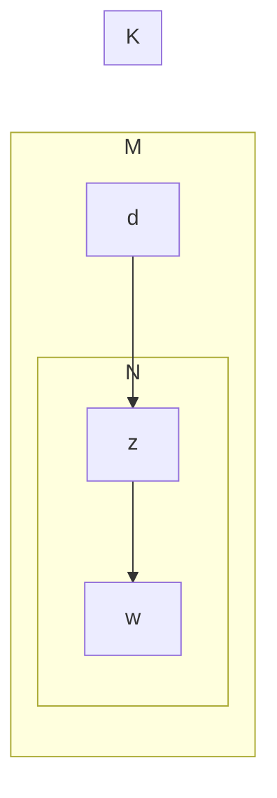
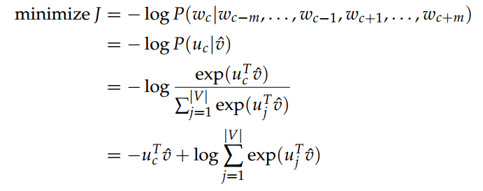
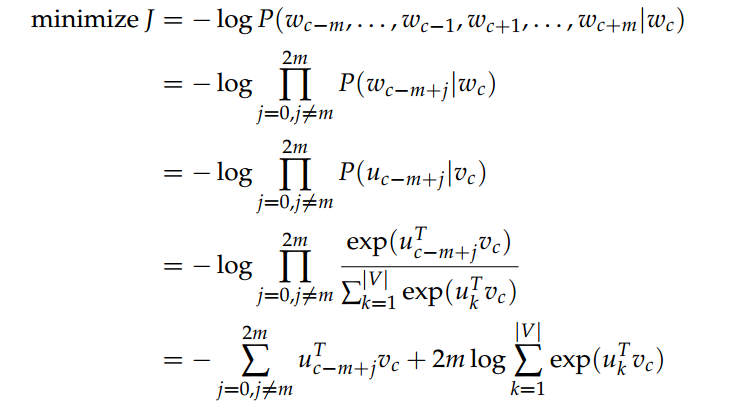
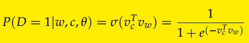
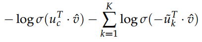
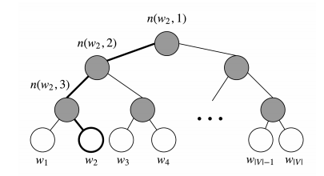

<!-- TOC -->

- [1. 理论](#1-%E7%90%86%E8%AE%BA)
  - [1.1. LDA](#11-lda)
    - [1.1.1. 前言：pLSA](#111-%E5%89%8D%E8%A8%80plsa)
    - [1.1.2. 原理](#112-%E5%8E%9F%E7%90%86)
    - [1.1.3. 实现细节](#113-%E5%AE%9E%E7%8E%B0%E7%BB%86%E8%8A%82)
  - [1.2. HMM和CRF](#12-hmm%E5%92%8Ccrf)
    - [1.2.1. 基础知识](#121-%E5%9F%BA%E7%A1%80%E7%9F%A5%E8%AF%86)
      - [1.2.1.1. （1）HMM](#1211-1hmm)
      - [1.2.1.2. （2）CRF](#1212-2crf)
    - [1.2.2. 具体实现](#122-%E5%85%B7%E4%BD%93%E5%AE%9E%E7%8E%B0)
      - [1.2.2.1. （1）HMM](#1221-1hmm)
      - [1.2.2.2. （2）CRF](#1222-2crf)
      - [1.2.2.3. （3）参考链接](#1223-3%E5%8F%82%E8%80%83%E9%93%BE%E6%8E%A5)
  - [1.3. 循环神经网络](#13-%E5%BE%AA%E7%8E%AF%E7%A5%9E%E7%BB%8F%E7%BD%91%E7%BB%9C)
    - [1.3.1. 递推式](#131-%E9%80%92%E6%8E%A8%E5%BC%8F)
      - [1.3.1.1. （1）RNN](#1311-1rnn)
      - [1.3.1.2. （2）LSTM](#1312-2lstm)
      - [1.3.1.3. （3）GRU](#1313-3gru)
  - [1.4. 卷积神经网络](#14-%E5%8D%B7%E7%A7%AF%E7%A5%9E%E7%BB%8F%E7%BD%91%E7%BB%9C)
    - [1.4.1. 经典公式](#141-%E7%BB%8F%E5%85%B8%E5%85%AC%E5%BC%8F)
    - [1.4.2. 动机](#142-%E5%8A%A8%E6%9C%BA)
  - [1.5. 注意力](#15-%E6%B3%A8%E6%84%8F%E5%8A%9B)
  - [1.6. 机器学习相关](#16-%E6%9C%BA%E5%99%A8%E5%AD%A6%E4%B9%A0%E7%9B%B8%E5%85%B3)
    - [1.6.1. 特征选择](#161-%E7%89%B9%E5%BE%81%E9%80%89%E6%8B%A9)
    - [1.6.2. 处理数据不均衡的问题](#162-%E5%A4%84%E7%90%86%E6%95%B0%E6%8D%AE%E4%B8%8D%E5%9D%87%E8%A1%A1%E7%9A%84%E9%97%AE%E9%A2%98)
    - [1.6.3. GBDT](#163-gbdt)
    - [1.6.4. 模型评价](#164-%E6%A8%A1%E5%9E%8B%E8%AF%84%E4%BB%B7)
    - [1.6.5. 特征工程](#165-%E7%89%B9%E5%BE%81%E5%B7%A5%E7%A8%8B)
    - [1.6.6. MLE V.S. MAP](#166-mle-vs-map)
    - [1.6.7. 损失函数理解](#167-%E6%8D%9F%E5%A4%B1%E5%87%BD%E6%95%B0%E7%90%86%E8%A7%A3)
  - [1.7. 深度学习基础](#17-%E6%B7%B1%E5%BA%A6%E5%AD%A6%E4%B9%A0%E5%9F%BA%E7%A1%80)
    - [1.7.1. 激活函数](#171-%E6%BF%80%E6%B4%BB%E5%87%BD%E6%95%B0)
    - [1.7.2. 正则化](#172-%E6%AD%A3%E5%88%99%E5%8C%96)
    - [1.7.3. batchnorm/layernorm/groupnorm](#173-batchnormlayernormgroupnorm)
- [2. 工具](#2-%E5%B7%A5%E5%85%B7)
  - [2.1. 爬虫](#21-%E7%88%AC%E8%99%AB)
    - [2.1.1. scrapy](#211-scrapy)
  - [2.2. 大数据](#22-%E5%A4%A7%E6%95%B0%E6%8D%AE)
  - [2.3. 深度学习](#23-%E6%B7%B1%E5%BA%A6%E5%AD%A6%E4%B9%A0)
- [3. project](#3-project)
  - [3.1. word2vec](#31-word2vec)
    - [3.1.1. 模型介绍](#311-%E6%A8%A1%E5%9E%8B%E4%BB%8B%E7%BB%8D)
    - [3.1.2. tricks](#312-tricks)
    - [3.1.3. 具体实现](#313-%E5%85%B7%E4%BD%93%E5%AE%9E%E7%8E%B0)
  - [3.2. 语言模型](#32-%E8%AF%AD%E8%A8%80%E6%A8%A1%E5%9E%8B)
  - [3.3. NER](#33-ner)
    - [3.3.1. 经典深度模型框架](#331-%E7%BB%8F%E5%85%B8%E6%B7%B1%E5%BA%A6%E6%A8%A1%E5%9E%8B%E6%A1%86%E6%9E%B6)
    - [3.3.2. 具体实现细节](#332-%E5%85%B7%E4%BD%93%E5%AE%9E%E7%8E%B0%E7%BB%86%E8%8A%82)
  - [3.4. 排序模型](#34-%E6%8E%92%E5%BA%8F%E6%A8%A1%E5%9E%8B)
  - [3.5. 文本分类](#35-%E6%96%87%E6%9C%AC%E5%88%86%E7%B1%BB)
    - [3.5.1. TextCNN](#351-textcnn)
    - [3.5.2. RCNN](#352-rcnn)
    - [3.5.3. BiLSTM](#353-bilstm)

<!-- /TOC -->

# 1. 理论

## 1.1. LDA

### 1.1.1. 前言：pLSA

> 介绍：pLSA是用一个生成模型来建模文章的生成过程。假设有K个主题，M篇文章；对语料库中的任意文章d，假设该文章有N个词，则对于其中的每一个词，我们首先选择一个主题z，然后在当前主题的基础上生成一个词w。



> **公式**：
$$p(w|d)=\sum_zp(w|z,d)p(z|d)$$
- 假设：
$$p(w|z,d)=p(w|z)$$
- 似然函数：
$$L=\prod_m^M\prod_n^Np(w_m,d_n)^{c(w_m,d_n)}$$

> **训练**：EM算法

- **使用场景**：含有隐变量的概率模型  
- **推导**：  
    1. 含隐变量的极大似然函数为：
   $$L(\Theta)=logP(Y|\Theta)=log\sum_ZP(Y|Z,\Theta)P(Z|\Theta)$$  
    1. 设第i次迭代得到的参数为$\Theta^{(i)}$，则此时可以定义如下的函数，在第i+1步应该使下式最大化
   $$L=L(\Theta)-L(\Theta^{(i)})=log\sum_ZP(Y|Z,\Theta)P(Z|\Theta)-P(Y|\Theta^{(i)})$$
    1. 利用jesen不等式，可以得到上式下界:  
   $$
   \begin{aligned}
   L&=log\sum_ZP(Y|Z,\Theta)P(Z|\Theta)-P(Y|\Theta^{(i)}) \\
   &=log\sum_zP(Z|Y,\Theta^{(i)})\frac{P(Y|Z,\Theta)P(Z|\Theta)}{P(Z|Y,\Theta^{(i)})}-P(Y|\Theta^{(i+1)})\\
   &>=\sum_zP(Z|Y,\Theta^{(i)})log\frac{P(Y|Z,\Theta)P(Z|\Theta)}{P(Z|Y,\Theta^{(i)})}-P(Y|\Theta^{(i+1)})\\
   &=\sum_zP(Z|Y,\Theta^{(i)})log\frac{P(Y|Z,\Theta)P(Z|\Theta)}{P(Z|Y,\Theta^{(i)})P(Y|\Theta^{(i)})}\\
   \end{aligned}
   $$
   $$
   \begin{aligned}
   \Theta^{(i+1)}&=arg\max_{\Theta}L(\Theta) \Rightarrow \Theta^{(i+1)}=arg\max_{\Theta}\Big(L(\Theta^{(i)})+\sum_ZP(Z|Y,\Theta^{(i)})log\frac{P(Y|Z,\Theta)P(Z|\Theta)}{P(Z|Y,\Theta^{(i)})P(Y|\Theta^{(i)})}\Big)\\
   &\Rightarrow \Theta^{(i+1)}=arg\max_{\Theta}\Big(\sum_ZP(Z|Y,\Theta^{(i+1)})logP(Y|Z,\Theta)P(Z|\Theta)\Big)\\
   &\Rightarrow \Theta^{(i+1)}=arg\max_{\Theta}\Big(\sum_ZP(Z|Y,\Theta^{(i+1)})logP(Y,Z|\Theta))\Big)\\
   &\Rightarrow \Theta^{(i+1)}=arg\max_{\Theta}Q(\Theta,\Theta^{(i+1)})\\
   \end{aligned}
   $$

- **流程**：  
    1. 输入：观测变量数据Y，隐变量Z，联合分布$P(Y,Z|\Theta)$,条件分布$P(Z|Y,\Theta)$
    2. 输出：模型参数$\Theta$  
    3. 初始化：初始化$\Theta$为$\Theta^{(0)}$
    4. 迭代流程： 
       + E step:记$\Theta^{(i)}$为第i步迭代对$\Theta$的估计值，在i+1次迭代的E步，计算  
        $$Q(\Theta,\Theta^{(i)})=E_z[log(P(Y,Z|\Theta)|Y,\Theta^{(i)}]=\sum_z(logP(Y,Z|\Theta)P(Z|Y,\Theta^{(i)}))$$
       + M step:确定第i+1次参数迭代的值$\Theta^{(i+1)}$
        $$\Theta^{(i+1)}=arg\max_{\Theta}Q(\Theta,\Theta^{(i)})$$
       + 重复E step和M step，直到收敛。

### 1.1.2. 原理

> **与plsa关系**：LDA可以看作是pLSA的贝叶斯版本， 其文本生成过程与pLSA基本相同， 不同的是为主题分布和词分布分别加了两个狄利克雷（Dirichlet） 先验。

>> *频率学派与贝叶斯学派*：pLSA采用的是频率派思想， 将每篇文章对应的主题分布$p(z_k|d_m)$和每个主题对应的词分布$p(w_m|z_k)$看成确定的未知常数， 并可以求解出来； 而LDA采用的是贝叶斯学派的思想， 认为待估计的参数（主题分布和词分布） 不再是一个固定的常数， 而是服从一定分布的随机变量。 这个分布符合一定的先验概率分布（即狄利克雷分布） ， 并且在观察到样本信息之后， 可以对先验分布进行修正， 从而得到后验分布。

>> *狄利克雷先验*：LDA之所以选择狄利克雷分布作为先验分布， 是因为它为多项式分布的共轭先验概率分布，后验概率依然服从狄利克雷分布， 这样做可以为计算带来便利。 

> **概率图**：



### 1.1.3. 实现细节

## 1.2. HMM和CRF

### 1.2.1. 基础知识
**HMM和CRF同属于概率图模型。**  
概率图模型分为贝叶斯网络（Bayesian Network） 和马尔可夫网络（Markov Network） 两大类。 贝叶斯网络可以用一个有向图结构表示， 马尔可夫网络可以表示成一个无向图的网络结构。更详细地说， 概率图模型包括了朴素贝叶斯模型、最大熵模型、 隐马尔可夫模型、 条件随机场、 主题模型等， 在机器学习的诸多场景中都有着广泛的应用。

#### 1.2.1.1. （1）HMM

> **简介**：HMM是一类贝叶斯网络。图示和联合概率分布如下：

```mermaid

```

> **两个基本假设**：
- 齐次马尔科夫假设
$$p(i_t|i_{1...t-1},o_{1...t-1})=p(i_t|i_{t-1})$$
- 观测独立性假设
$$p(o_t|i_t,i_{1...t-1},o_{1...t-1})=p(o_t|i_t)$$

> **三个基本问题**：
- 概率计算问题  
前向-后向算法。以前向算法为例。  
    1. 定义$\alpha_t(i)=p(o_1,o_2,...,o_t,i_t|\lambda)$，表示前t步的观测为$o_{1...t}$且t步状态为$i_t$的概率。  
    2. 算法：  

- 学习问题  
    1. 监督学习：频数计算即可  
    2. 非监督学习：Baul-Welch算法（也就是EM算法）  

- 预测问题:**维特比算法**


#### 1.2.1.2. （2）CRF

### 1.2.2. 具体实现

#### 1.2.2.1. （1）HMM

实现代码：

```python
# five elements for HMM
states = ('Healthy', 'Fever')
 
observations = ('normal', 'cold', 'dizzy')
 
start_probability = {'Healthy': 0.6, 'Fever': 0.4}
 
transition_probability = {
   'Healthy' : {'Healthy': 0.7, 'Fever': 0.3},
   'Fever' :   {'Healthy': 0.4, 'Fever': 0.6},
   }
 
emission_probability = {
   'Healthy' : {'normal': 0.5, 'cold': 0.4, 'dizzy': 0.1},
   'Fever'   : {'normal': 0.1, 'cold': 0.3, 'dizzy': 0.6},
   }

#动态规划
def Viterbit(obs, states, s_pro, t_pro, e_pro):
	path = { s:[] for s in states} # init path: path[s] represents the path ends with s
	curr_pro = {}
	for s in states:
		curr_pro[s] = s_pro[s]*e_pro[s][obs[0]]
	for i in range(1, len(obs)):
		last_pro = curr_pro
		curr_pro = {}
		for curr_state in states:
			max_pro, last_sta = max(((last_pro[last_state]*t_pro[last_state][curr_state]*e_pro[curr_state][obs[i]], last_state) 
				                       for last_state in states))
			curr_pro[curr_state] = max_pro
			path[curr_state].append(last_sta)
	# find the final largest probability
	max_pro = -1
	max_path = None
	for s in states:
		path[s].append(s)
		if curr_pro[s] > max_pro:
			max_path = path[s]
			max_pro = curr_pro[s]
		# print '%s: %s'%(curr_pro[s], path[s]) # different path and their probability
	return max_path


if __name__ == '__main__':
	obs = ['normal', 'cold', 'dizzy','cold']
	print(Viterbit(obs, states, start_probability, transition_probability, emission_probability))
```

流程：

<div align=center></div>

#### 1.2.2.2. （2）CRF

```python
# -*- coding:utf-8 -*-

from keras.layers import Layer
import keras.backend as K


class CRF(Layer):
    """纯Keras实现CRF层
    CRF层本质上是一个带训练参数的loss计算层，因此CRF层只用来训练模型，
    而预测则需要另外建立模型。
    """
    def __init__(self, ignore_last_label=False, **kwargs):
        """ignore_last_label：定义要不要忽略最后一个标签，起到mask的效果
        """
        self.ignore_last_label = 1 if ignore_last_label else 0
        super(CRF, self).__init__(**kwargs)
    def build(self, input_shape):
        self.num_labels = input_shape[-1] - self.ignore_last_label
        self.trans = self.add_weight(name='crf_trans',
                                     shape=(self.num_labels, self.num_labels),
                                     initializer='glorot_uniform',
                                     trainable=True)
    def log_norm_step(self, inputs, states):
        """递归计算归一化因子
        要点：1、递归计算；2、用logsumexp避免溢出。
        技巧：通过expand_dims来对齐张量。
        """
        states = K.expand_dims(states[0], 2) # (batch_size, output_dim, 1)
        trans = K.expand_dims(self.trans, 0) # (1, output_dim, output_dim)
        output = K.logsumexp(states+trans, 1) # (batch_size, output_dim)
        return output+inputs, [output+inputs]
    def path_score(self, inputs, labels):
        """计算目标路径的相对概率（还没有归一化）
        要点：逐标签得分，加上转移概率得分。
        技巧：用“预测”点乘“目标”的方法抽取出目标路径的得分。
        """
        point_score = K.sum(K.sum(inputs*labels, 2), 1, keepdims=True) # 逐标签得分
        labels1 = K.expand_dims(labels[:, :-1], 3)
        labels2 = K.expand_dims(labels[:, 1:], 2)
        labels = labels1 * labels2 # 两个错位labels，负责从转移矩阵中抽取目标转移得分
        trans = K.expand_dims(K.expand_dims(self.trans, 0), 0)
        trans_score = K.sum(K.sum(trans*labels, [2,3]), 1, keepdims=True)
        return point_score+trans_score # 两部分得分之和
    def call(self, inputs): # CRF本身不改变输出，它只是一个loss
        return inputs
    def loss(self, y_true, y_pred): # 目标y_pred需要是one hot形式
        mask = 1-y_true[:,1:,-1] if self.ignore_last_label else None
        y_true,y_pred = y_true[:,:,:self.num_labels],y_pred[:,:,:self.num_labels]
        init_states = [y_pred[:,0]] # 初始状态
        log_norm,_,_ = K.rnn(self.log_norm_step, y_pred[:,1:], init_states, mask=mask) # 计算Z向量（对数）
        log_norm = K.logsumexp(log_norm, 1, keepdims=True) # 计算Z（对数）
        path_score = self.path_score(y_pred, y_true) # 计算分子（对数）
        return log_norm - path_score # 即log(分子/分母)
    def accuracy(self, y_true, y_pred): # 训练过程中显示逐帧准确率的函数，排除了mask的影响
        mask = 1-y_true[:,:,-1] if self.ignore_last_label else None
        y_true,y_pred = y_true[:,:,:self.num_labels],y_pred[:,:,:self.num_labels]
        isequal = K.equal(K.argmax(y_true, 2), K.argmax(y_pred, 2))
        isequal = K.cast(isequal, 'float32')
        if mask == None:
            return K.mean(isequal)
        else:
            return K.sum(isequal*mask) / K.sum(mask)
```

#### 1.2.2.3. （3）参考链接

- https://zhuanlan.zhihu.com/p/28305337

## 1.3. 循环神经网络

### 1.3.1. 递推式

#### 1.3.1.1. （1）RNN

> **公式**：
$$
\begin{aligned}
    Net_t &= Wh_{t-1}+Ux_t\\
    h_{t} &= f(net_t)
\end{aligned}
$$

> **问题**：
梯度计算公式：在算loss时会有很多以下单元的连乘，这可能导致梯度消失或梯度爆炸问题。

$$
\begin{aligned}
    \frac{dnet_t}{dnet_{t-1}}=\frac{dnet_t}{dh_{t-1}}\frac{dh_{t-1}}{dnet_{t-1}}=Wf^{'}(net_{t-1})
\end{aligned}
$$

  - **梯度消失**：借助lstm或gru的门控机制来解决。
  - **梯度爆炸**：借助梯度裁剪技术来解决。

#### 1.3.1.2. （2）LSTM

$$
\begin{aligned}
    i_{t} &= sigmoid(W_ih_{t-1}+U_ix_t+b_i)\\
    o_{t} &= sigmoid(W_oh_{t-1}+U_ox_t+b_0)\\
    f_{t} &= sigmoid(W_fh_{t-1}+U_fx_t+b_f)\\
    
\end{aligned}
$$

#### 1.3.1.3. （3）GRU

## 1.4. 卷积神经网络

### 1.4.1. 经典公式

$$
S(i,j) = \sum_m\sum_nI(i+m,i+n)K(m,n)
$$

### 1.4.2. 动机

> **稀疏连接**：

> **参数共享**：

> ****

## 1.5. 注意力

## 1.6. 机器学习相关

### 1.6.1. 特征选择

> **过滤式选择**：

> **包裹式选择**：

> **嵌入式选择**：

### 1.6.2. 处理数据不均衡的问题

- 基于数据的方法

  1. 重采样：
     + 随机重采样：对于样本数较少的类别进行有放回的采样。问题是会显著提升训练的时间，并且会带来过拟合的问题。
     + smote算法：对于每个少数类样本都生成一些新样本。具体步骤是从样本x的k邻近中随机选择一个样本y，然后在x到y的连线上随机生成一个新样本。

  2. 欠采样
     + 随机欠采样：对于样本数较多的类别进行随机采样。问题是会损失一些样本信息。
     + Informed Undersampling：
       + （1） Easy Ensemble算法。 每次从多数类$S_{maj}$中上随机抽取一个子集E($|E|=|S_{min}|$)， 然后用$E+S_{min}$训练一个分类器； 重复上述过程若干次， 得到多个分类器，最终的分类结果是这多个分类器结果的融合
       + （2） Balance Cascade算法。 **级联结构**， 在每一级中从多数类$S_{maj}$中随机抽取子集E， 用$E+S_{min}$训练该级的分类器； 然后将$S_{maj}$中能够被当前分类器正确判别的样本剔除掉， 继续下一级的操作， 重复若干次得到级联结构； 最终的输出结果也是各级分类器结果的融合

- 基于算法的方法
  1. 对不同类别的损失进行加权。
  2. 单类学习
  3. 异常检测   

### 1.6.3. GBDT

### 1.6.4. 模型评价

### 1.6.5. 特征工程

### 1.6.6. MLE V.S. MAP

### 1.6.7. 损失函数理解

- 分类问题的损失函数
  - 真实损失函数：0-1损失
  - 代理损失函数：
    1. **hinge loss**：
    2. **logistic loss**：
    3. **交叉熵损失**：  

- 回归问题的损失函数

## 1.7. 深度学习基础

### 1.7.1. 激活函数

### 1.7.2. 正则化

### 1.7.3. batchnorm/layernorm/groupnorm

# 2. 工具

## 2.1. 爬虫

### 2.1.1. scrapy

- (1)教程

## 2.2. 大数据

## 2.3. 深度学习

# 3. project

## 3.1. word2vec

### 3.1.1. 模型介绍

- cbow：用周围词来预测中心词。概率计算通过点积和softmax，上下文向量是周围所有词的平均词向量。损失函数是交叉熵损失。

<div align=center></div>

- skip-gram：用中心词来预测周围词，计算方式与cbow类似。

<div align=center></div>

### 3.1.2. tricks

> 由于softmax是针对整个词库进行操作的，每次更新都要对所有词的词向量进行更新，时间复杂度O(V)。因此采取负采样和层次softmax进行加速。

1. 负采样：定义新的损失函数加速计算。对于词对定义一个新的概率来表示该词对是否是真的从语料库中得到的。

<div align=center></div>

通过对每个词对中的上下文词或者中心词进行替换可以得到一些负样本，从而优化目标为：
- skip-gram   
  <div align=center></div>

- cbow 
  <div align=center></div>
- **remark**：负样本采样的经验规律，词频的0.75次方。


2. 层次softmax：是对原始softmax的改进。采用huffman树来加速计算的实现，方式是使高频词的路径更短。

<div align=center></div>

修改概率计算公式为：

<div align=center></div>

其中[]的意义如下，这使得所有词的概率和为1。

<div align=center></div>

如上图的huffman数可以得到对w2的概率公式为：

<div align=center></div>


### 3.1.3. 具体实现

## 3.2. 语言模型

## 3.3. NER

### 3.3.1. 经典深度模型框架

### 3.3.2. 具体实现细节

## 3.4. 排序模型

## 3.5. 文本分类

### 3.5.1. TextCNN

### 3.5.2. RCNN

### 3.5.3. BiLSTM


