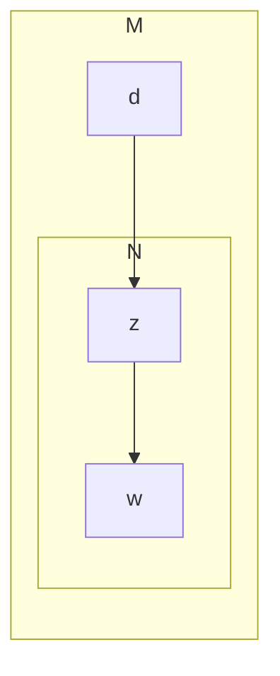
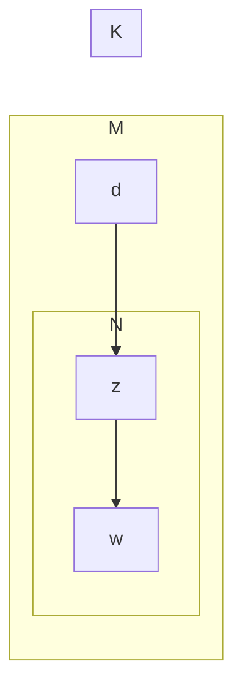

<script type="text/javascript" src="http://cdn.mathjax.org/mathjax/latest/MathJax.js?config=default"></script>
<!-- TOC -->

- [1. 理论](#1-%E7%90%86%E8%AE%BA)
  - [1.1. LDA](#11-lda)
    - [1.1.1. 前言：pLSA](#111-%E5%89%8D%E8%A8%80plsa)
    - [1.1.2. 原理](#112-%E5%8E%9F%E7%90%86)
    - [1.1.3. 实现细节](#113-%E5%AE%9E%E7%8E%B0%E7%BB%86%E8%8A%82)
  - [1.2. HMM和CRF](#12-hmm%E5%92%8Ccrf)
    - [1.2.1. 基础知识](#121-%E5%9F%BA%E7%A1%80%E7%9F%A5%E8%AF%86)
      - [1.2.1.1. （1）HMM](#1211-1hmm)
      - [1.2.1.2. （2）CRF](#1212-2crf)
    - [1.2.2. 具体实现](#122-%E5%85%B7%E4%BD%93%E5%AE%9E%E7%8E%B0)
      - [1.2.2.1. （1）HMM](#1221-1hmm)
      - [1.2.2.2. （2）CRF](#1222-2crf)
      - [1.2.2.3. （3）参考链接](#1223-3%E5%8F%82%E8%80%83%E9%93%BE%E6%8E%A5)
  - [1.3. 循环神经网络](#13-%E5%BE%AA%E7%8E%AF%E7%A5%9E%E7%BB%8F%E7%BD%91%E7%BB%9C)
    - [1.3.1. 递推式](#131-%E9%80%92%E6%8E%A8%E5%BC%8F)
      - [1.3.1.1. （1）RNN](#1311-1rnn)
      - [1.3.1.2. （2）LSTM](#1312-2lstm)
      - [1.3.1.3. （3）GRU](#1313-3gru)
  - [1.4. 注意力](#14-%E6%B3%A8%E6%84%8F%E5%8A%9B)
  - [1.5. 机器学习相关](#15-%E6%9C%BA%E5%99%A8%E5%AD%A6%E4%B9%A0%E7%9B%B8%E5%85%B3)
    - [1.5.1. 特征选择](#151-%E7%89%B9%E5%BE%81%E9%80%89%E6%8B%A9)
    - [1.5.2. GBDT](#152-gbdt)
    - [1.5.3. 模型评价](#153-%E6%A8%A1%E5%9E%8B%E8%AF%84%E4%BB%B7)
    - [1.5.4. 特征工程](#154-%E7%89%B9%E5%BE%81%E5%B7%A5%E7%A8%8B)
- [2. 工具](#2-%E5%B7%A5%E5%85%B7)
  - [2.1. 爬虫](#21-%E7%88%AC%E8%99%AB)
    - [2.1.1. scrapy](#211-scrapy)
  - [2.2. 大数据](#22-%E5%A4%A7%E6%95%B0%E6%8D%AE)
  - [2.3. 深度学习](#23-%E6%B7%B1%E5%BA%A6%E5%AD%A6%E4%B9%A0)
- [3. project](#3-project)
  - [3.1. word2vec](#31-word2vec)
  - [3.2. 语言模型](#32-%E8%AF%AD%E8%A8%80%E6%A8%A1%E5%9E%8B)
  - [3.3. NER](#33-ner)
  - [3.4. 排序模型](#34-%E6%8E%92%E5%BA%8F%E6%A8%A1%E5%9E%8B)

<!-- /TOC -->

# 1. 理论

## 1.1. LDA

### 1.1.1. 前言：pLSA

> 介绍：pLSA是用一个生成模型来建模文章的生成过程。假设有K个主题，M篇文章；对语料库中的任意文章d，假设该文章有N个词，则对于其中的每一个词，我们首先选择一个主题z，然后在当前主题的基础上生成一个词w。



> **公式**：
$$p(w|d)=\sum_zp(w|z,d)p(z|d)$$
- 假设：
$$p(w|z,d)=p(w|z)$$
- 似然函数：
$$L=\prod_m^M\prod_n^Np(w_m,d_n)^{c(w_m,d_n)}$$

> **训练**：EM算法

- **使用场景**：含有隐变量的概率模型  
- **推导**：  
    1. 含隐变量的极大似然函数为：
   $$L(\Theta)=logP(Y|\Theta)=log\sum_ZP(Y|Z,\Theta)P(Z|\Theta)$$  
    1. 设第i次迭代得到的参数为$\Theta^{(i)}$，则此时可以定义如下的函数，在第i+1步应该使下式最大化
   $$L=L(\Theta)-L(\Theta^{(i)})=log\sum_ZP(Y|Z,\Theta)P(Z|\Theta)-P(Y|\Theta^{(i)})$$
    1. 利用jesen不等式，可以得到上式下界:  
   $$
   \begin{aligned}
   L&=log\sum_ZP(Y|Z,\Theta)P(Z|\Theta)-P(Y|\Theta^{(i)}) \\
   &=log\sum_zP(Z|Y,\Theta^{(i)})\frac{P(Y|Z,\Theta)P(Z|\Theta)}{P(Z|Y,\Theta^{(i)})}-P(Y|\Theta^{(i+1)})\\
   &>=\sum_zP(Z|Y,\Theta^{(i)})log\frac{P(Y|Z,\Theta)P(Z|\Theta)}{P(Z|Y,\Theta^{(i)})}-P(Y|\Theta^{(i+1)})\\
   &=\sum_zP(Z|Y,\Theta^{(i)})log\frac{P(Y|Z,\Theta)P(Z|\Theta)}{P(Z|Y,\Theta^{(i)})P(Y|\Theta^{(i)})}\\
   \end{aligned}
   $$
   $$
   \begin{aligned}
   \Theta^{(i+1)}&=arg\max_{\Theta}L(\Theta) \Rightarrow \Theta^{(i+1)}=arg\max_{\Theta}\Big(L(\Theta^{(i)})+\sum_ZP(Z|Y,\Theta^{(i)})log\frac{P(Y|Z,\Theta)P(Z|\Theta)}{P(Z|Y,\Theta^{(i)})P(Y|\Theta^{(i)})}\Big)\\
   &\Rightarrow \Theta^{(i+1)}=arg\max_{\Theta}\Big(\sum_ZP(Z|Y,\Theta^{(i+1)})logP(Y|Z,\Theta)P(Z|\Theta)\Big)\\
   &\Rightarrow \Theta^{(i+1)}=arg\max_{\Theta}\Big(\sum_ZP(Z|Y,\Theta^{(i+1)})logP(Y,Z|\Theta))\Big)\\
   &\Rightarrow \Theta^{(i+1)}=arg\max_{\Theta}Q(\Theta,\Theta^{(i+1)})\\
   \end{aligned}
   $$

- **流程**：  
    1. 输入：观测变量数据Y，隐变量Z，联合分布$P(Y,Z|\Theta)$,条件分布$P(Z|Y,\Theta)$
    2. 输出：模型参数$\Theta$  
    3. 初始化：初始化$\Theta$为$\Theta^{(0)}$
    4. E step:记$\Theta^{(i)}$为第i步迭代对$\Theta$的估计值，在i+1次迭代的E步，计算  
   $$Q(\Theta,\Theta^{(i)})=E_z[log(P(Y,Z|\Theta)|Y,\Theta^{(i)}]=\sum_z(logP(Y,Z|\Theta)P(Z|Y,\Theta^{(i)}))$$
    1. M step:确定第i+1次参数迭代的值$\Theta^{(i+1)}$
   $$\Theta^{(i+1)}=arg\max_{\Theta}Q(\Theta,\Theta^{(i)})$$
    1. 重复E step和M step，直到收敛。

### 1.1.2. 原理

> **与plsa关系**：LDA可以看作是pLSA的贝叶斯版本， 其文本生成过程与pLSA基本相同， 不同的是为主题分布和词分布分别加了两个狄利克雷（Dirichlet） 先验。

>> *频率学派与贝叶斯学派*：pLSA采用的是频率派思想， 将每篇文章对应的主题分布$p(z_k|d_m)$和每个主题对应的词分布$p(w_m|z_k)$看成确定的未知常数， 并可以求解出来； 而LDA采用的是贝叶斯学派的思想， 认为待估计的参数（主题分布和词分布） 不再是一个固定的常数， 而是服从一定分布的随机变量。 这个分布符合一定的先验概率分布（即狄利克雷分布） ， 并且在观察到样本信息之后， 可以对先验分布进行修正， 从而得到后验分布。

>> *狄利克雷先验*：LDA之所以选择狄利克雷分布作为先验分布， 是因为它为多项式分布的共轭先验概率分布，后验概率依然服从狄利克雷分布， 这样做可以为计算带来便利。 

> **概率图**：



### 1.1.3. 实现细节

## 1.2. HMM和CRF

### 1.2.1. 基础知识
**HMM和CRF同属于概率图模型。**  
概率图模型分为贝叶斯网络（Bayesian Network） 和马尔可夫网络（Markov Network） 两大类。 贝叶斯网络可以用一个有向图结构表示， 马尔可夫网络可以表示成一个无向图的网络结构。更详细地说， 概率图模型包括了朴素贝叶斯模型、最大熵模型、 隐马尔可夫模型、 条件随机场、 主题模型等， 在机器学习的诸多场景中都有着广泛的应用。

#### 1.2.1.1. （1）HMM

> **简介**：HMM是一类贝叶斯网络。图示和联合概率分布如下：

```mermaid

```

> **两个基本假设**：
- 齐次马尔科夫假设
$$p(i_t|i_{1...t-1},o_{1...t-1})=p(i_t|i_{t-1})$$
- 观测独立性假设
$$p(o_t|i_t,i_{1...t-1},o_{1...t-1})=p(o_t|i_t)$$

> **三个基本问题**：
- 概率计算问题  
前向-后向算法。以前向算法为例。  
    1. 定义$\alpha_t(i)=p(o_1,o_2,...,o_t,i_t|\lambda)$，表示前t步的观测为$o_{1...t}$且t步状态为$i_t$的概率。  
    2. 算法：  

- 学习问题  
    1. 监督学习：频数计算即可  
    2. 非监督学习：Baul-Welch算法（也就是EM算法）  

- 预测问题:**维特比算法**


#### 1.2.1.2. （2）CRF

### 1.2.2. 具体实现

#### 1.2.2.1. （1）HMM

实现代码：

```python
# five elements for HMM
states = ('Healthy', 'Fever')
 
observations = ('normal', 'cold', 'dizzy')
 
start_probability = {'Healthy': 0.6, 'Fever': 0.4}
 
transition_probability = {
   'Healthy' : {'Healthy': 0.7, 'Fever': 0.3},
   'Fever' :   {'Healthy': 0.4, 'Fever': 0.6},
   }
 
emission_probability = {
   'Healthy' : {'normal': 0.5, 'cold': 0.4, 'dizzy': 0.1},
   'Fever'   : {'normal': 0.1, 'cold': 0.3, 'dizzy': 0.6},
   }

#动态规划
def Viterbit(obs, states, s_pro, t_pro, e_pro):
	path = { s:[] for s in states} # init path: path[s] represents the path ends with s
	curr_pro = {}
	for s in states:
		curr_pro[s] = s_pro[s]*e_pro[s][obs[0]]
	for i in range(1, len(obs)):
		last_pro = curr_pro
		curr_pro = {}
		for curr_state in states:
			max_pro, last_sta = max(((last_pro[last_state]*t_pro[last_state][curr_state]*e_pro[curr_state][obs[i]], last_state) 
				                       for last_state in states))
			curr_pro[curr_state] = max_pro
			path[curr_state].append(last_sta)
	# find the final largest probability
	max_pro = -1
	max_path = None
	for s in states:
		path[s].append(s)
		if curr_pro[s] > max_pro:
			max_path = path[s]
			max_pro = curr_pro[s]
		# print '%s: %s'%(curr_pro[s], path[s]) # different path and their probability
	return max_path


if __name__ == '__main__':
	obs = ['normal', 'cold', 'dizzy','cold']
	print(Viterbit(obs, states, start_probability, transition_probability, emission_probability))
```

流程：


#### 1.2.2.2. （2）CRF

```python
# -*- coding:utf-8 -*-

from keras.layers import Layer
import keras.backend as K


class CRF(Layer):
    """纯Keras实现CRF层
    CRF层本质上是一个带训练参数的loss计算层，因此CRF层只用来训练模型，
    而预测则需要另外建立模型。
    """
    def __init__(self, ignore_last_label=False, **kwargs):
        """ignore_last_label：定义要不要忽略最后一个标签，起到mask的效果
        """
        self.ignore_last_label = 1 if ignore_last_label else 0
        super(CRF, self).__init__(**kwargs)
    def build(self, input_shape):
        self.num_labels = input_shape[-1] - self.ignore_last_label
        self.trans = self.add_weight(name='crf_trans',
                                     shape=(self.num_labels, self.num_labels),
                                     initializer='glorot_uniform',
                                     trainable=True)
    def log_norm_step(self, inputs, states):
        """递归计算归一化因子
        要点：1、递归计算；2、用logsumexp避免溢出。
        技巧：通过expand_dims来对齐张量。
        """
        states = K.expand_dims(states[0], 2) # (batch_size, output_dim, 1)
        trans = K.expand_dims(self.trans, 0) # (1, output_dim, output_dim)
        output = K.logsumexp(states+trans, 1) # (batch_size, output_dim)
        return output+inputs, [output+inputs]
    def path_score(self, inputs, labels):
        """计算目标路径的相对概率（还没有归一化）
        要点：逐标签得分，加上转移概率得分。
        技巧：用“预测”点乘“目标”的方法抽取出目标路径的得分。
        """
        point_score = K.sum(K.sum(inputs*labels, 2), 1, keepdims=True) # 逐标签得分
        labels1 = K.expand_dims(labels[:, :-1], 3)
        labels2 = K.expand_dims(labels[:, 1:], 2)
        labels = labels1 * labels2 # 两个错位labels，负责从转移矩阵中抽取目标转移得分
        trans = K.expand_dims(K.expand_dims(self.trans, 0), 0)
        trans_score = K.sum(K.sum(trans*labels, [2,3]), 1, keepdims=True)
        return point_score+trans_score # 两部分得分之和
    def call(self, inputs): # CRF本身不改变输出，它只是一个loss
        return inputs
    def loss(self, y_true, y_pred): # 目标y_pred需要是one hot形式
        mask = 1-y_true[:,1:,-1] if self.ignore_last_label else None
        y_true,y_pred = y_true[:,:,:self.num_labels],y_pred[:,:,:self.num_labels]
        init_states = [y_pred[:,0]] # 初始状态
        log_norm,_,_ = K.rnn(self.log_norm_step, y_pred[:,1:], init_states, mask=mask) # 计算Z向量（对数）
        log_norm = K.logsumexp(log_norm, 1, keepdims=True) # 计算Z（对数）
        path_score = self.path_score(y_pred, y_true) # 计算分子（对数）
        return log_norm - path_score # 即log(分子/分母)
    def accuracy(self, y_true, y_pred): # 训练过程中显示逐帧准确率的函数，排除了mask的影响
        mask = 1-y_true[:,:,-1] if self.ignore_last_label else None
        y_true,y_pred = y_true[:,:,:self.num_labels],y_pred[:,:,:self.num_labels]
        isequal = K.equal(K.argmax(y_true, 2), K.argmax(y_pred, 2))
        isequal = K.cast(isequal, 'float32')
        if mask == None:
            return K.mean(isequal)
        else:
            return K.sum(isequal*mask) / K.sum(mask)
```

#### 1.2.2.3. （3）参考链接

- https://zhuanlan.zhihu.com/p/28305337

## 1.3. 循环神经网络

### 1.3.1. 递推式

#### 1.3.1.1. （1）RNN


$$
\begin{aligned}
    
\end{aligned}
$$

#### 1.3.1.2. （2）LSTM

#### 1.3.1.3. （3）GRU

## 1.4. 注意力

## 1.5. 机器学习相关

### 1.5.1. 特征选择

### 1.5.2. GBDT

### 1.5.3. 模型评价

### 1.5.4. 特征工程

# 2. 工具

## 2.1. 爬虫

### 2.1.1. scrapy

- (1)教程

## 2.2. 大数据

## 2.3. 深度学习

# 3. project

## 3.1. word2vec

## 3.2. 语言模型

## 3.3. NER

## 3.4. 排序模型


